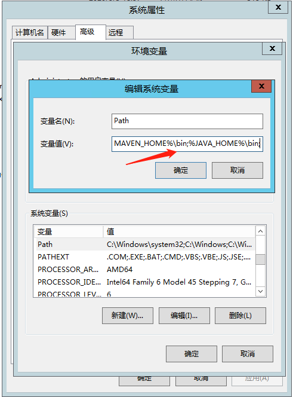

# SpringBoot

## 【构建】服务器环境安装

### JDK下载与安装

[JDK最新版本下载地址](https://www.oracle.com/java/technologies/javase-downloads.html)


将下载好后的文件进行解压缩





### maven下载与安装

#### 下载解压版

[maven最新版下载](https://maven.apache.org/download.cgi)


将下载好后的文件进行解压缩


#### 配置环境变量


配置
#### 配置阿里maven仓库


```xml
  <mirror>
	<id>nexus-aliyun</id>
	<mirrorOf>central</mirrorOf>
	<name>Nexus aliyun</name>
	<url>http://maven.aliyun.com/nexus/content/groups/public</url>
 </mirror>
```


### Jenkins相关插件安装和配置

#### 插件

`系统管理` → `管理插件`，安装插件：`Maven Integration`。`Maven Integration`这个插件用来构建maven项目


#### JDK配置


#### Maven配置


#### ssh配置

在系统配置中设置SSH服务器连接

 SSH Servers→新增→高级→Use password authentication, or use a different key进行配置


保存后可以随时修改等信息
保存后可以随时修改信息


## 【测试】服务器环境安装

### JDK下载与安装
### JDK下载与配置

 [参考上一节JDK下载与安装](#JDK下载与安装)

### FreeSSHd下载与安装
### FreeSSHd下载与配置

[FreeSSHd最新版本下载地址](http://www.freesshd.com/?ctt=download)


双击刚刚下载的freeSSHd.exe进行安装，安装时其他都是默认安装选项，只有最后两步会弹出对话框询问是否生成私钥和是否设置为系统服务，选择“yes"即可，因为没有生成私钥，SSH服务将不能启动，设置系统服务的话每次开机都会自动启动SSH服务。


因为刚刚安装时选择了设置成系统服务，那么程序会马上启动，因为FREESSHD还没有配置好，我们需要打开freesshd设置窗口进行配置，因此需要把刚刚启动的服务到进程里去结束掉，否则再点击桌面打开freesshd配置时SSH服务启动不了，因为22端口被占用了。如下图，结束掉进程里面的freesshdservice.exe进程。


点开桌面的freesshd图标，开始对freesshd进行配置。第一次打开会弹出它的欢迎框，之后就不会了。


先到USER选项卡添加SSH用户，如图，添加默认的系统管理员帐号，authorization选择NT authentication，这样的话密码就是系统管理员帐号的密码。然后勾选shell选项，确定添加。


回到主界面，选择Authentication选项卡，password authentication项选择Required项，Public key authentication选择Disabled项。如果不这样设置连接的时候将会出现Access denied的错误，导致ssh客户端不能连接。


设置文件路径


右键点击任务栏下的freesshd图标点击Unload推出软件，然后重新打开freesshd软件使6步骤的配置生效。打开后点击ssh server下的Click here to start 启动SSH服务


※关于开放22号端口或防火墙设置，此处不赘述。


### Nginx下载与配置

[nginx官方下载地址](http://nginx.org/en/download.html)


解压后配置文件路径


修改配置文件nginx-1.18.0\conf\nginx.conf


## 建立构建任务


### 建立项目和配置SVN文件获取


###  项目文件生成


```bash
echo install common-utils
cd code/EBD后台代码/gta-ebd/common-utils
echo %cd%
call mvn install 
cd ../bigscreen-api/
echo %cd%
call mvn package
cd ../../../EBD前端代码/gta-ebd-vue/
echo %cd%
npm install && npm run build
```
### 将文件上传至测试服务器并执行批处理操作


### 批处理文件


> downjar.bat

```bash
@echo off & setlocal EnableDelayedExpansion

title 杀死端口
title 关闭大屏后端

set port=6410
set pid=0
set pName=""

::将端口所对应的进程kill掉
for /f "tokens=2,5" %%b in ('netstat -ano ^| findstr ":%port%"') do (
    set pid=%%c
    set pName=""
    for /f "skip=3" %%a in ('tasklist /fi "pid eq %%c"') do  (
      set pName=%%a
	)
	if !pName! == ""   (
	if !pName! == "" (
 		echo 端口号【%port%】已被本机释放
	) else (
       echo 程序!pName!通过进程%%c在使用端口%port%
       taskkill /f /pid %%c
 	   echo 端口号【%port%】相关进程已杀死
    )
)

::将所对应的
if !pid! NEQ 0 (
	for /f "skip=3" %%a in ('tasklist /fi "pid eq %pid%"') do  (
	    set pName=%%a
	    echo %%a检测失败
	)
)

if !pName!=="" (
   echo 正在启动
   START javaw -Xms512m -Xmx1024m -Xmn512m -jar %~dp0bigscreen-api\bigscreen.jar  --server.port=!port!
   ::等待10秒钟
   ping -n 10 127.0.0.1>nul
   echo 启动完成
)else (
   echo !pName!重新启动失败，请重试
	if !pid!==0 (
	   echo 端口号【%port%】未使用
	) else (
       echo 端口号【%port%】相关进程已杀死
	)
) else (
   echo 关闭失败，请重试
)
::pause
exit
pause
::exit
```

> restartjar.bat

```bash
@echo off & setlocal EnableDelayedExpansion

title 杀死端口
title 启动大屏后端

set port=9999
set port=6410
set pid=0
set pName=""

::将端口所对应的进程kill掉
for /f "tokens=2,5" %%b in ('netstat -ano ^| findstr ":%port%"') do (
    set pid=%%c
    set pName=""
    for /f "skip=3" %%a in ('tasklist /fi "pid eq %%c"') do  (
      set pName=%%a
	)
	if !pName! == "" (
 		echo 端口号【%port%】已被本机释放
	) else (
       echo 程序!pName!通过进程%%c在使用端口%port%
       taskkill /f /pid %%c
 	   echo 端口号【%port%】相关进程已杀死
    )
)

::将所对应的
if !pid! NEQ 0 (
	for /f "skip=3" %%a in ('tasklist /fi "pid eq %pid%"') do  (
	    set pName=%%a
	    echo %%a检测失败
	)
)

if !pName!=="" (
	if !pid!==0 (
	   echo 端口号【%port%】未使用
	) else (
       echo 端口号【%port%】已无相关程序使用
	)
) else (
   echo 关闭失败，请重试
   echo 正在启动大屏后端%~dp0bigscreen.jar
   START javaw -Xms512m -Xmx1024m -Xmn512m -jar %~dp0bigscreen.jar  --server.port=!port!
   ping localhost -n 10 > nul
   echo 启动完成
)else (
   echo !pName!重新启动失败，请重试
)
pause
::exit
::pause
exit
```


> setconfigvue.bat

```bash
@echo off  
title 修改vue前端配置
cd %~dp0
echo const __host__ = "http://10.1.136.157:6310"; >vue/config/env.js
echo const __ebdhost__="http://10.1.137.105:6410"; >>vue/config/env.js
echo const __doorUrl = "http://10.1.135.40:8016/"; >>vue/config/env.js
exit
```