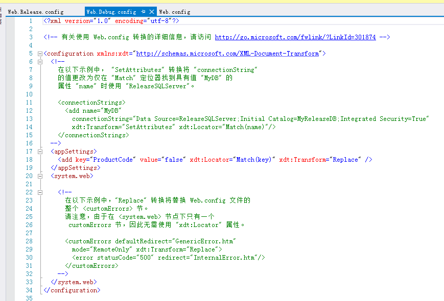

# asp.net
## 【构建】服务器环境安装

###  ASP.NET生成工具(MSBuild)

#### 下载

搜索引擎搜索VS2017,进入微软官方下载页面，在页面下方的“所有下载”中展开“工具”栏位，按下图下载生产工具。

#### 安装

后续根据你发布的类型选择你要安装的工具类型。

### Jenkins相关插件安装和配置

#### 安装插件

#### 配置

##  【测试】服务器环境安装

### IIS安装时必须安装管理服务或添加安装管理服务

### Web Deploy安装

#### 下载

地址：https://www.iis.net/downloads/microsoft/web-deploy

#### 安装

#### 站点启用Web Deploy发布

在启用之前，请按照通常IIS部署站点方式部署网站，然后再这个网站右键如下图启用。

## 建立构建任务

### 准备构建配置

### 新建构建任务

## 问题

### 报错问题

请把MSBuild加入信任

### AppSettings的值问题

