# 解决什么问题

MySQL 社区版本是免费开源的，其基本功能与企业版大致相同。其软件体积小，安装使用简单，并且易于维护。

# 诞生与发展历程

  MySQL的历史最早可以追溯到1979年，那时Oracle也才小打小闹，微软的SQL Server影子都没有。Monty Widenius在其合伙的TcX小公司工作时，用BASIC设计了一个报表工具，可以在4M主频和16KB内在的计算机上运行。随着时间的推移，这个小工具被用C重写并迁移到Unix上运行。当时，它只是一个很底层的面向报表的存储引擎，再配上一个报表前端。它就是大家知道的Unireg。

1990年，该公司的客户急切要求访问其数据的SQL接口，TcX提出其中一方案是把数据都加载进一个商用数据库。但Monty对这个方案的执行速度并不满意。他尝试将mSQL的代码用做SQL层，并用自己的低层级的存储引擎集成进来，但效果也不好。于是, Monty决心自己重写一个SQL。

1996年，MySQL 1.0发布,只面向一小拨人。同年10月，MySQL 3.11.1发布，只提供了Solaris下的二进制版本。一个月后，Linux二进制包也发布。 此时的MySQL还非常简陋，除了在一个表上做一些Insert，Update，Delete和Select 操作，没有其他更多的功能。

 接下来的两年里，MySQL依次移植到各个平台下。它发布时，采用的许可策略，有些与众不同：允许免费商用，但是不能将MySQL与自己的产品绑定在一起发布。如果想一起发布，就必须使用特殊许可，意味着要花银子。

 MySQL3.22应该是一个标志性的版本，提供了基本的SQL支持。还带有一个复杂的优化器，新版本速度很快，且非常稳定。尽管如此，它还是不支持事务、子查询、外键、存储过程和视图，只存在表级别的锁。

1999-2000，一个名叫MySQL AB的独立公司成立了（Monty Widenius也作为创始人之一），它聘请了几位开发者并与Sleepycat公司建立合作伙伴关系，提供访问Berkeley DB数据文件的SQL接口。自从Berkeley DB具备事务功能之后，它就赋于了MySQL支持事务的特质，补上了它的短板。在为集成的Berkeley DB做了一些修改之后，MySQL 3.23发布了。

 2000 年，MySQL 公布了自己的源代码，并采用GPL（GNU General Public License）许可协议，正式进入开源世界。

 2000年4月，有了Slashdot的支持与赞助，master/slave机制加入。不支持事务的老存储引擎ISAM被重写了，并以MyISAM的形式发布。经过大量的改良，当前版本也支持了全文搜索。MySQL AB还曾有一个跟NuShpere短期的合作，在MySQL中加入了一个支持行级锁和事务的引擎Gemini，但因法律问题于2001年结束了。也就在这时，Heikki Tuuri提议用自己的引擎集成到其中，并接手MySQL AB的工作，这个引擎就是同样支持行级锁和事务的InnoDB。

2003年3月，MySQL 4.0正式发布。新增特性：除了MySQL/InnoDB组合，还有查询缓存(Query Cache)，优化器的改良，客户端/服务器间的协议用SSL加密。该引擎由Innobase公司开发，支持事务，支持行级锁，适用于OLTP等高并发场景。

2004年10月，MySQL 4.1发布，2005年10月发布里程碑的一个版本 5.0。4.1版本新增子查询，空间索引支持也加到了MyISAM引擎中。Unicode支持也被实现了。客户端/服务器协议也有了大量的改动，而且支持预处理语句（prepared statement）。5.0版本加入了存储过程，服务器端游标，触发器，视图，分布式事务（Xa transactions），查询优化器的显著改进以及其它的一些特性。MySQL的开发者发现如果要让4.1 稳定下就要花很大的工夫，如果他们要把4.1的新特性都加进去，就必须先搞定存储过程，所以他们痛下决心另创了一个分枝来开发5.0。经一度因这个造成了一些混乱——两个分枝同时处在alpha 阶段，后来4.1稳定了，这个尴尬也就随之而解了。2005年，Oracle收购Innobase公司。

在5.0 之后的版本里，MySQL明确地表现出迈向高性能数据库的发展步伐。5.1版本紧随其后，其中加了好多的新的改进，如表分区（table data partitioning），基于行的复制（row-based replication）,事件调度器（event schedular），和让新存储引擎和其它插件轻松集成的标准化插件API。

2008年1月16，Sun以10亿美金收购MySQL AB。同年，发布MySQL 5.1，其开始支持定时器（Event scheduler），分区，基于行的复制等特性。

2009年4月20，Oracle公司以74亿美元收购Sun公司，自此MySQL数据库进入Oracle时代。

2010年4月22，发布MySQL 5.5，其主要新特性包括半同步的复制及对SIGNAL/RESIGNAL的异常处理功能的支持，最重要的是InnoDB存储引擎终于变为当前MySQL的默认存储引擎。MySQL 5.5不是时隔两年后的一次简单的版本更新，而是加强了MySQL各个方面在企业级的特性。Oracle公司同时也承诺MySQL 5.5和未来版本仍是采用GPL授权的开源产品。同年发布MySQLcluster 7.1 ，MySQL Cluster 是MySQL适合于分布式计算环境的高实用、高冗余版本。它采用了NDB Cluster 存储引擎，允许在1个 Cluster 中运行多个MySQL服务器。在MySQL 5.0及以上的二进制版本中、以及与最新的Linux版本兼容的RPM中提供了该存储引擎。（注意，要想获得MySQL Cluster 的功能，必须安装 mysql-server 和 mysql-max RPM）

 2011年4月，MySQL 5.6发布，作为被Oracle收购后，第一个正式发布并做了大量变更的版本（5.5版本主要是对社区开发的功能的集成），对复制模式，优化器等做了大量的变更，其中最重要的主从GTID复制模式，大大降低了MySQL高可用操作的复杂性，除此之外，由于对源代码进行了大量的调整，到2013年，5.6版本才正式GA。

 2013年4月，5.6版本GA后，新特性的变更，开始作为独立的5.7分支进行进一步开发，在并行控制，并行复制等方面，进行了大量的优化调整，正式GA于2015年10月份，这个版本也是到目前为止的，最新的稳定版本分支。

2016年9月，Oracle决定跳过MySQL 5.x命名系列，并抛弃之前的MYSQL 6，7两个分支（从来没有对外发布的两个分支），直接进入MySQL 8版本命名，也就是MySQL 8.0版本的开发。

最后，看看下面这个表格，表中给出了最近几个大版本的发布时间，及截止到本书出版，其最新的小版本及其发布时间。
| 版本 |   GA时间   | 最新的小版本 | 最新小版本的发布时间 | 产品支持的结束时间 |
| :--: | :--------: | :----------: | :------------------: | :----------------: |
| 5.1  | 2008-11-14 |    5.1.73    |      2013-12-03      |      2013-12       |
| 5.5  | 2010-12-03 |    5.5.61    |      2018-07-27      |      2018-12       |
| 5.6  | 2013-02-05 |    5.6.41    |      2018-07-27      |      2021-02       |
| 5.7  | 2015-10-21 |    5.7.23    |      2018-07-27      |      2023-10       |
| 8.0  | 2018-04-19 |    8.0.12    |      2018-07-27      |      2026-04       |
从表中的数据来看，

1. 大概每3年会发布一个大的版本。

2. 产品的支持周期一般是8年。

3. 以为MySQL 5.5是老古董了，但官方仍然在不断更新。

# 安装更新卸载（引用使用移除）

## For Windows

### 下载

https://dev.mysql.com/downloads/mysql/

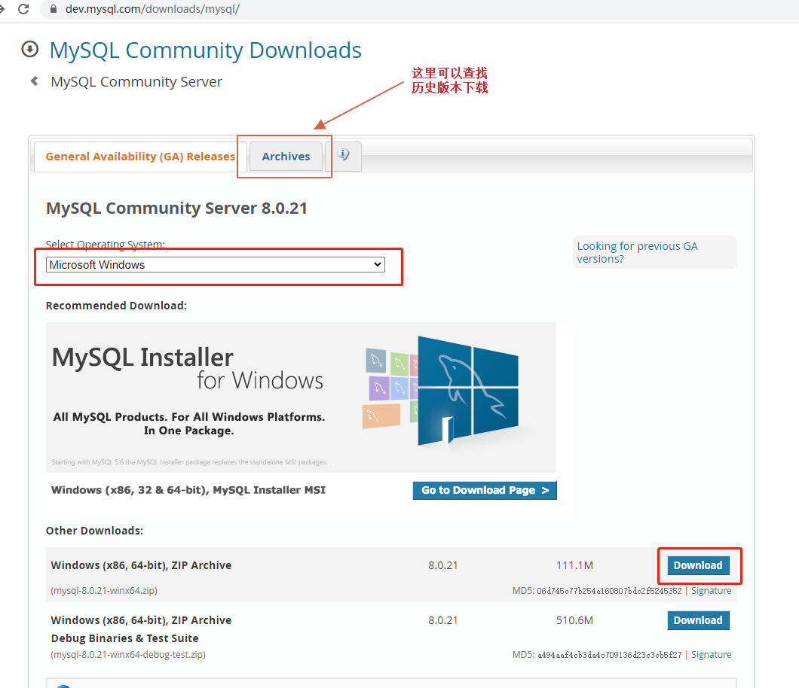

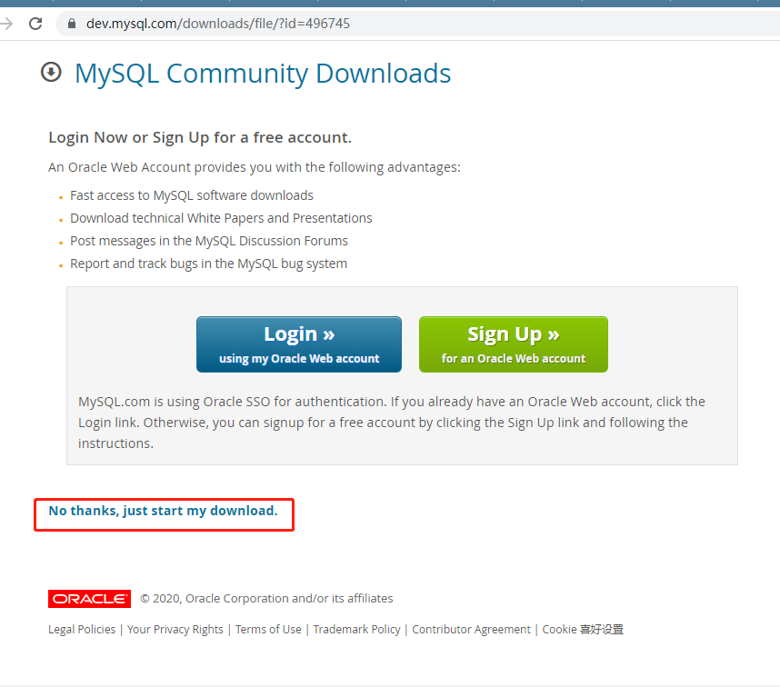

> 注意：官方网站随时可能改版，请找到关于MySQL Community下载页面，就可以下载最新版

### 安装与启动

#### 解压

下载后的安装包，进行解压缩，在根目录中创建my.ini配置文件（文件编码必须是ANSI）

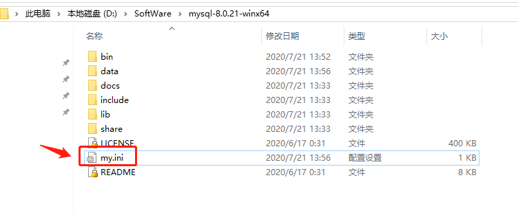

> 8.0版本

```ini
[mysql]
# 设置mysql客户端默认字符集
default-character-set=utf8
[mysqld]
#设置3306端口
port = 3308
# 设置mysql数据库的数据的存放目录（可以是绝对路径，也可以是相对路径）
datadir=data
# 允许最大连接数
max_connections=200
# 服务端使用的字符集默认为8比特编码的latin1字符集
character-set-server=utf8
# 创建新表时将使用的默认存储引擎
default-storage-engine=INNODB
```

> 5.7版本

```ini
[mysql]
# 设置 mysql 客户端默认字符集
default-character-set=utf8
[mysqld]
#设置 3306 端口
port = 3306
# 设置mysql数据库的数据的存放目录（可以是绝对路径，也可以是相对路径）
datadir=data
# 允许最大连接数
max_connections=200
# 服务端使用的字符集默认为 8 比特编码的 latin1 字符集
character-set-server=utf8
# 创建新表时将使用的默认存储引擎
default-storage-engine=INNODB
# 定义了 mysql 应该支持的 sql 语法，数据校验等！
sql_mode="STRICT_TRANS_TABLES,NO_ENGINE_SUBSTITUTION,NO_ZERO_DATE,NO_ZERO_IN_DATE,ERROR_FOR_DIVISION_BY_ZERO,NO_AUTO_CREATE_USER"
#限制 server 接受的数据包大小
max_allowed_packet=1G
```

#### 初始化数据库

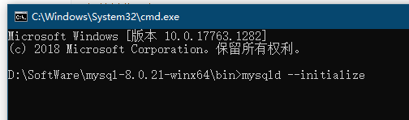

```bash
#初始并获取密码：
mysqld --initialize
#初始无密码：
mysqld --initialize-insecure
```

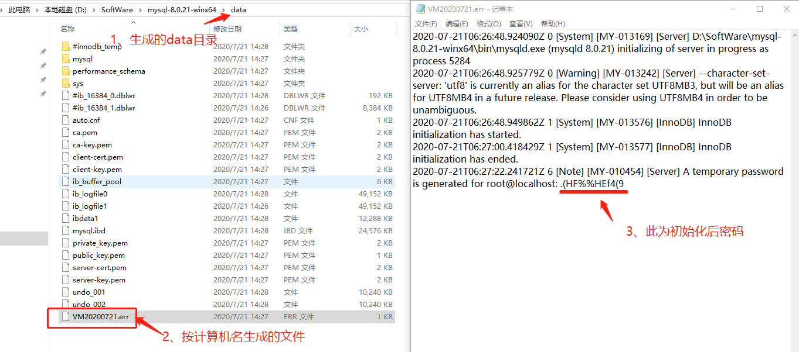

#### 注册windows服务

在bin目录中进行下列命令进行安装或移除

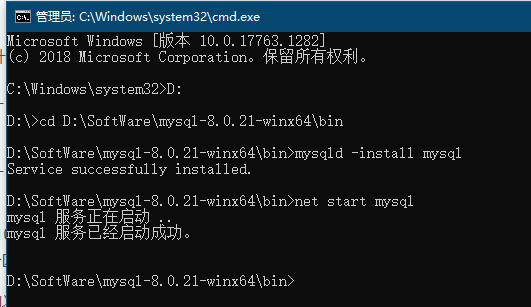

```bash
#将MySQL注册成名称为mysql8为windows，故名称可自己按需定义
#服务安装：
mysqld -install mysql8
#服务移除：
mysqld --remove mysql8
#通过net启停服务（net系统命令，可在任意目录操作）
#启动服务
net start mysql8
#停止服务
net stop mysql8
```

###  卸载

移除注册的windows服务即为卸载

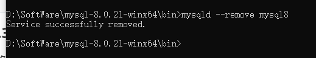

### 安装注意事项

如果注册服务时出现左图错误，请下载 Visual C++ Redistributable Packages for Visual Studio 2013进行安装即可。下载地址为 https://www.microsoft.com/zh-CN/download/details.aspx?id=40784。

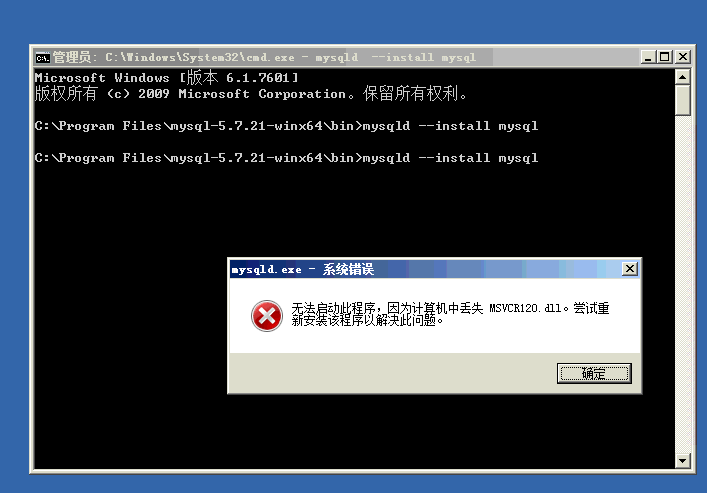

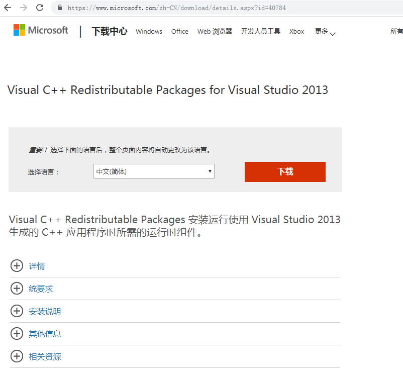

## For CentOS8

### 在线安装

```bash
yum install mysql-server
```

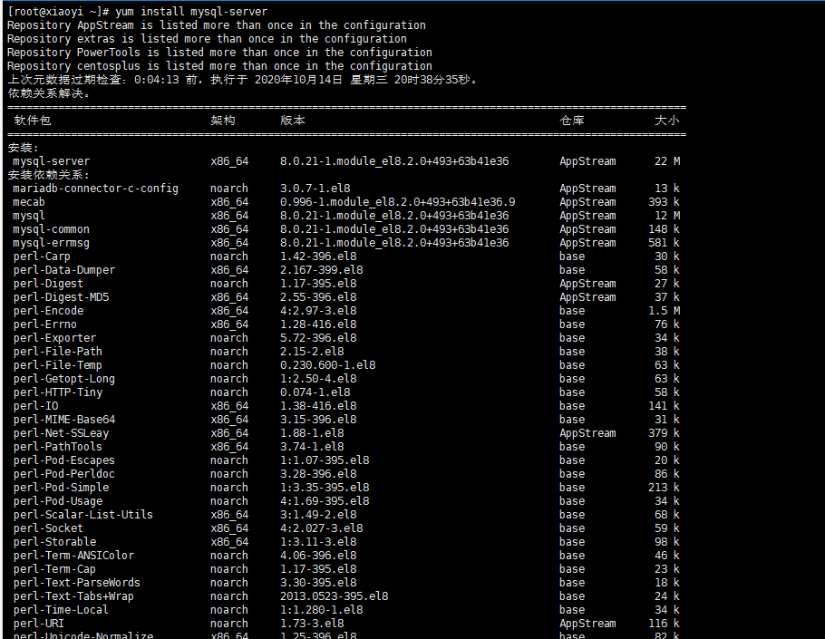

### 启动

```bash
systemctl start mysqld
#开机启动
systemctl enable mysqld
```

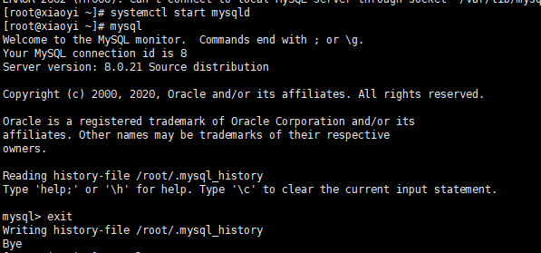

安装后密码为空，端口3306，如果需要修改配置，请操作/etc/my.cnf.d配置文件。


# 配置

## 修改密码

```mysql
-- 8.0.4 以前：
set password for 'root'@'localhost'=password('root');
-- 8.0.4 以后：
ALTER USER 'root'@'localhost' IDENTIFIED WITH mysql_native_password BY 'root';
-- 修改完密码后，退出重新登录，进行开启远程操作
```

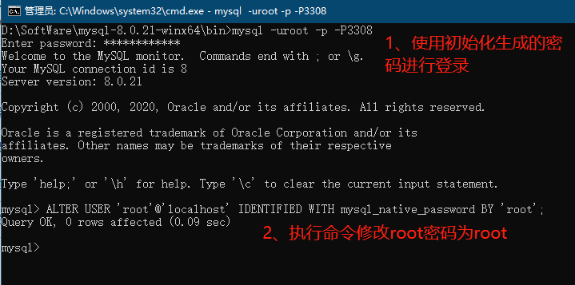

## 开启远程访问

```mysql
use mysql;
-- 更新 root 用户,允许任何 IP 登录
update user set host ='%' where user ='root';
-- 授权 root 用户拥有数据服务器所有数据库的所有权限（若执行预计报错，这）
-- 5.7
grant all privileges on *.* to 'root'@'%' identified by "root";
-- 8.0
grant all privileges on *.* to 'root'@'%';
-- 刷新权限 
flush privileges; 
```

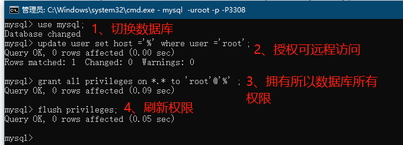

## 备份还原

```bash
-- 备份：
mysqldump -uroot -p123456 –ER -i csust > d:\csust.sql
-- 还原：
mysql -uroot -p --default-character-set=utf8 –c csust < d:\csust.sql
```


# 常用语句

## 外键

当MySQL中设置了foreign key关联，造成无法更新或删除数据。可以通过设置FOREIGN_KEY_CHECKS变量来避免这种情况。

```mysql
-- 禁用外键约束
SET FOREIGN_KEY_CHECKS = 0;
-- 启动外键约束
SET FOREIGN_KEY_CHECKS = 1;
-- 查看当前FOREIGN_KEY_CHECKS的值
SELECT  @@FOREIGN_KEY_CHECKS;
```

## 查询数据库所有表名

```mysql
select  table_name from information_schema.tables where table_schema='<数据库名>' and table_type='basetable' and table_name='<表名>' and table_rows!=0;
```

## 新增字段

```mysql
-- 新增字段前，判断字段是否存在当前表中
DROP PROCEDURE IF EXISTS add_col_homework;
DELIMITER $$
CREATE PROCEDURE add_col_homework ()
BEGIN
    SET @tableName='qas_e_organization';
	SET @talbeColumn='Path';
	SET @talbeColumnType='varchar(255)';
	SET @talbeColumnComment='组织机构路径（用“,”间隔父级与子级机构码）';
	IF not EXISTS(SELECT *	FROM information_schema.columns	WHERE (column_name =@talbeColumn	AND TABLE_NAME = @tableName	AND TABLE_SCHEMA IN (SELECT DATABASE()))) THEN
	  set @vSql=CONCAT('ALTER TABLE ',@tableName,' ADD COLUMN ',@talbeColumn,'  ',@talbeColumnType,' CHARACTER SET utf8 COLLATE utf8_general_ci NULL DEFAULT NULL COMMENT ''', @talbeColumnComment,'''');
	 	PREPARE stmt FROM  @vSql;
		EXECUTE stmt;
		DEALLOCATE PREPARE stmt;
	END IF;
END$$
DELIMITER ;
CALL add_col_homework();
DROP PROCEDURE IF EXISTS add_col_homework;
```

## 游标示例

```mysql
-- 通过游标赋值
DROP PROCEDURE IF EXISTS setOrgPath ;

DELIMITER $$
CREATE PROCEDURE setOrgPath ()
BEGIN
		DECLARE my_id VARCHAR (50);-- 自定义变量 1
		DECLARE my_parentid VARCHAR (50);-- 自定义变量 2
		DECLARE this_parentid VARCHAR (50);-- 自定义变量 2
		DECLARE my_path VARCHAR (200);-- 自定义变量 3
		DECLARE done INT DEFAULT FALSE; -- 自定义控制游标循环变量,默认 false
		DECLARE  My_Cursor  CURSOR  FOR  (SELECT  id,parentid,orgcode  FROM qas_e_organization);-- 定义游标并输入结果集

		DECLARE CONTINUE HANDLER FOR NOT FOUND
				SET done = TRUE;-- 绑定控制变量到游标,游标循环结束自动转 true
				OPEN My_Cursor;-- 打开游标
					myLoop :LOOP-- 开始循环体,myLoop 为自定义循环名,结束循环时用到
					FETCH My_Cursor INTO my_id,my_parentid,my_path;-- 将游标当前读取行的数据顺序赋予自定义变量 12
					IF done THEN -- 判断是否继续循环
						LEAVE myLoop;-- 结束循环
					END IF;
					
						-- 自己要做的事情,在 sql 中直接使用自定义变量即可
						SET this_parentid = my_parentid;
						WHILE LENGTH(IFNULL(this_parentid, '')) > 0 DO
							SELECT  parentid,CONCAT(orgcode,  ',',  my_path)  INTO this_parentid,my_path FROM qas_e_organization WHERE id = this_parentid;
						END WHILE;
						UPDATE qas_e_organization SET path = my_path WHERE  id = my_id;
						COMMIT;-- 提交事务				
						-- 自己要做的事情结束
						
				  END LOOP myLoop;-- 结束自定义循环体
				CLOSE My_Cursor;-- 关闭游标
END$$
DELIMITER ;

CALL setOrgPath ();
DROP PROCEDURE IF EXISTS setOrgPath ;
```

## 查询数据表中数据记录

```mysql
DELIMITER ;;
DROP PROCEDURE IF EXISTS `statis_rows`;
CREATE PROCEDURE statis_rows (IN v_schema VARCHAR(50))
BEGIN
	DECLARE sql_str VARCHAR(5000);
	DECLARE no_more_departments INTEGER DEFAULT 0;
	DECLARE sql_cur CURSOR FOR (SELECT CONCAT('select ',"'",table_schema,"'",",'",table_name,"',",'count(1)',', ''',TABLE_COMMENT,''' ',' into @v_tab_schema,@v_tab_name,@v_count,@v_comment from `',TABLE_SCHEMA,'`
	.',TABLE_NAME,'') FROM information_schema.TABLES WHERE table_schema = v_schema AND table_type='base table' and TABLE_NAME!='v_table_rows' );
	DECLARE CONTINUE HANDLER FOR NOT FOUND SET no_more_departments = 1;
	
	DROP TABLE IF EXISTS `v_table_rows`;
	CREATE TABLE `v_table_rows` (
	`v_tab_schema` varchar(255) DEFAULT NULL COMMENT '数据库名称',
	`v_tab_name` varchar(255) DEFAULT NULL COMMENT '表名',
	`v_count` varchar(255) DEFAULT NULL COMMENT '记录数',
	`v_sysdate` datetime DEFAULT NULL COMMENT '数据记录属统计时间',
	`v_comment` varchar(255) DEFAULT NULL COMMENT '表注释'
	) ENGINE=InnoDB DEFAULT CHARSET=utf8 COMMENT='数据库表记录数据条数';
	
	OPEN sql_cur;
			myLoop: LOOP
				FETCH sql_cur INTO sql_str;
			  IF no_more_departments = 1 THEN
					LEAVE myLoop;
				END IF;
				
				SET @v_sql = sql_str;
				PREPARE stmt FROM @v_sql;
				EXECUTE stmt;
				DEALLOCATE PREPARE stmt;
				
				INSERT INTO v_table_rows VALUES (@v_tab_schema, @v_tab_name, @v_count, sysdate(),@v_comment);
				
			END LOOP myLoop;
		CLOSE sql_cur;
		
		select v_tab_schema '数据库名称',v_tab_name '表名',`v_count` '记录数',`v_sysdate`  '数据记录属统计时间',v_comment '表注释'  from v_table_rows ORDER BY v_tab_schema,v_tab_name,v_count ;
		drop TABLE v_table_rows;
END;;

DELIMITER ;
call statis_rows('qas_mxzy');

DROP PROCEDURE IF EXISTS statis_rows;
```

## 分组排序

```mysql
SELECT id, rank FROM ( SELECT id, @rownum :=@rownum + 1, IF ( @examid = examid AND @classid = classid, IF ( @score = score ,@rank ,@rank :=@rank + 1 ) ,@rank := 1 ) AS rank, @examid := examid, @classid := classid, @score := score FROM ( SELECT st.id, st.studentid, st.score, sc.classid, ST.examid FROM yk_student_exam st LEFT JOIN yk_studentclass sc ON ST.studentid = sc.studentid WHERE ST. STATUS = 3 AND examid = 50 ORDER BY examid ASC, classid ASC, score DESC ) student_exam, ( SELECT @rownum := 0, @examid := NULL ,@classid := NULL ,@score = NULL ,@rank := 0 ) temp ) result
```

# 高级知识点

## 主从复制

### 能解决的问题

- 备份数据
- 读写分离

### 配置

> 两个数据库，必须分开在两台服务器，即使是为了自己实验测试。

主服务器my.ini

```ini
[mysqld]
#设置服务器id，为1表示主服务器,实例唯一ID，不能和canal的slaveId重复
server-id=1
#注意log-bin配置的是日志文件名前缀路径，日志文件在datadir生成
log-bin=mysql-bin
#选择mixed模式 
binlog-format=mixed
#需要同步的数据库名，如果有多个数据库，可重复此参数，每个数据库一行
binlog-do-db=test
```

```mysql
create user 'master'@'%' identified with mysql_native_password by 'pass';
GRANT REPLICATION SLAVE ON *.* TO 'master'@'%';
flush privileges;
show master status;
```

从服务my.ini

```ini
[mysqld]
server-id=2
#与主服务器相同
log-bin=master-1-mysql-bin
#与主服务器相同
binlog-format=mixed
#与主服务器相同
replicate-do-db=test
```

```mysql
stop slave;
change master to master_host='127.0.0.1', master_port=3308,master_user='master',master_password='pass',master_log_file='master-1-mysql-bin.000001',master_log_pos=2335;
start slave;
show slave status\G;
```

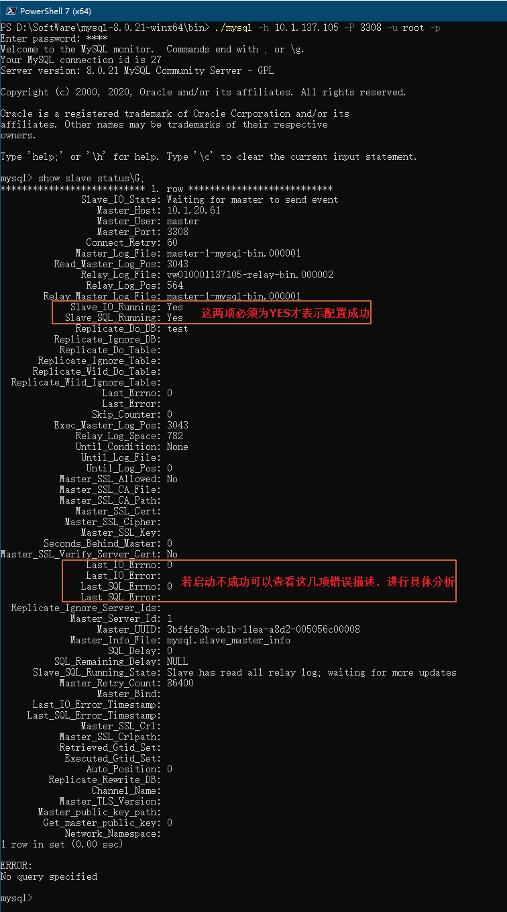