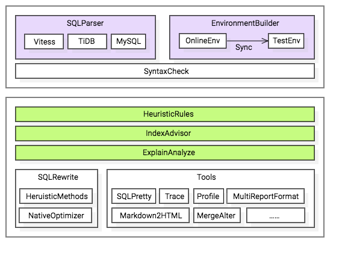
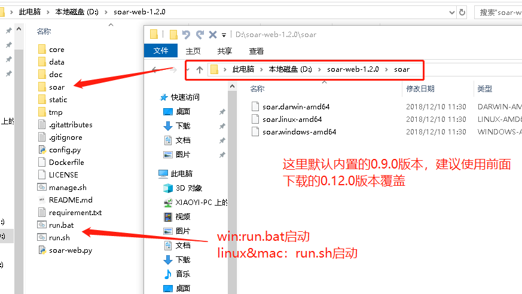

[toc]


# SOAR

SOAR(SQL Optimizer And Rewriter) 是一个对 SQL 进行优化和改写的自动化工具。 由小米人工智能与云平台的数据库团队开发与维护。

# 功能特点

* 跨平台支持（支持 Linux, Mac 环境，Windows 环境理论上也支持，不过未全面测试）
* 目前只支持 MySQL 语法族协议的 SQL 优化
* 支持基于启发式算法的语句优化
* 支持复杂查询的多列索引优化（UPDATE, INSERT, DELETE, SELECT）
* 支持 EXPLAIN 信息丰富解读
* 支持 SQL 指纹、压缩和美化
* 支持同一张表多条 ALTER 请求合并
* 支持自定义规则的 SQL 改写

# 快速入门

## 安装使用
### 下载二进制安装包

```bash
wget https://github.com/XiaoMi/soar/releases/download/${tag}/soar.${OS}-amd64 -O soar
chmod a+x soar
如：
wget https://github.com/XiaoMi/soar/releases/download/0.11.0/soar.linux-amd64 -O soar
chmod a+x soar
```

### 源码安装

#### 依赖软件

一般依赖

* Go 1.10+
* git

高级依赖（仅面向开发人员）

* [mysql](https://dev.mysql.com/doc/refman/8.0/en/mysql.html) 客户端版本需要与容器中MySQL版本相同，避免出现由于认证原因导致无法连接问题
* [docker](https://docs.docker.com/engine/reference/commandline/cli/) MySQL Server测试容器管理
* [govendor](https://github.com/kardianos/govendor) Go包管理
* [retool](https://github.com/twitchtv/retool) 依赖外部代码质量静态检查工具二进制文件管理

#### 生成二进制文件

```bash
go get -d github.com/XiaoMi/soar
cd ${GOPATH}/src/github.com/XiaoMi/soar && make
```

#### 开发调试

如下指令如果您没有精力参与SOAR的开发可以跳过。

* make deps 依赖检查
* make vitess 升级Vitess Parser依赖
* make tidb 升级TiDB Parser依赖
* make fmt 代码格式化，统一风格
* make lint 代码质量检查
* make docker 启动一个MySQL测试容器，可用于测试依赖元数据检查的功能或不同版本MySQL差异
* make test 运行所有的测试用例
* make cover 代码测试覆盖度检查
* make doc 自动生成命令行参数中-list-XX相关文档
* make daily 每日构建，时刻跟进Vitess, TiDB依赖变化
* make release 生成Linux, Windows, Mac发布版本

### 安装验证

```bash
echo 'select * from film' | ./soar
```

## 体系架构



SOAR主要由语法解析器，集成环境，优化建议，重写逻辑，工具集五大模块组成。下面将对每个模块的作用及设计实现进行简述，更详细的算法及逻辑会在各个独立章节中详细讲解。

### 语法解析和语法检查

一条SQL从文件，标准输入或命令行参数等形式传递给SOAR后首先进入语法解析器，这里一开始我们选用了vitess的语法解析库作为SOAR的语法解析库，但随时需求的不断增加我们发现有些复杂需求使用vitess的语法解析实现起来比较逻辑比较复杂。于是参考业务其他数据库产品，我们引入了TiDB的语法解析器做为补充。我们发现这两个解析库还存在一定的盲区，于是又引入了MySQL执行返回结果作为多版本SQL方言的补充。大家也可以看到在语法解析器这里，SOAR的实现方案是松散的、可插拔的。SOAR并不直接维护庞大的语法解析库，它把各种优秀的语法解析库集成在一起，各取所长。

### 集成环境

集成环境区分`线上环境`和`测试环境`两种，分别用于解决不同场景下用户的SQL优化需求。一种常见的情况是已有表结构需要优化查询SQL的场景，可以从线上环境导出表结构和足够的采样数据到测试环境，在测试环境上就可以放心的执行各种高危操作而不用担心数据被损坏。另一种常见的情况是建一套全新的数据库，需要验证提供的数据字典中是否存在优化的可能。对于这种情况，很有可能你不需要知道线上环境在哪儿，完全只是想先试试看，如果报错了马上改对就是了。当然还有更多种组合的场景需求，将在[集成环境](http://github.com/XiaoMi/soar/blob/master/doc/environment.md)中介绍。

### 优化建议

目前SOAR可以提供的优化建议有基于启发式规则(通常也称之为经验)的优化建议，基于索引优化算法给出的索引优化建议，以及基于EXPLAIN信息给出的解读。

### 启发式规则建议

下面这段代码是启发式规则的的元数据结构，它由规则代号，危险等级，规则摘要，规则解释，SQL示例，建议位置，规则函数等7部分组成。每一条SQL经过语法解析后会经过数百个启发式规则的逐一检查，命中了的规则将会保存在一个叫heuristicSuggest的变量中传递下去，与其他优化建议合并输出。这里最核心的部分，也是代码最多的部分在heuristic.go，里面包含了所有的启发式规则实现的函数。所有的启发式规则列表保存在rules.go文件中。

```Golang
// Rule 评审规则元数据结构
type Rule struct {
    Item     string                  `json:"Item"`     // 规则代号
    Severity string                  `json:"Severity"` // 危险等级：L[0-8], 数字越大表示级别越高
    Summary  string                  `json:"Summary"`  // 规则摘要
    Content  string                  `json:"Content"`  // 规则解释
    Case     string                  `json:"Case"`     // SQL示例
    Position int                     `json:"Position"` // 建议所处SQL字符位置，默认0表示全局建议
    Func     func(*Query4Audit) Rule `json:"-"`        // 函数名
}
```

### 索引优化

关于索引优化，数据库经过几十年的发展，DBA沉淀了很多宝贵的经验，怎样把这些感性的经验转化为覆盖全面、逻辑可推导的算法是这种模块最大的挑战。很幸运的是SOAR并不是第一个尝试做这类算法整理的产品，有很多前人的著作、论文、博客等的知识储备。毫不夸张的说，为了写成这个模块我们读了不下5百万字的著作和论文，还不包括网络上各种大神的博客，这些老师们的知识结晶收集整理在[鸣谢](http://github.com/XiaoMi/soar/blob/master/doc/thanks.md)章节。使用到的算法在[索引优化](http://github.com/XiaoMi/soar/blob/master/doc/indexing.md)章节有详细的描述，虽然在某些算法理解上可能还存在一定争议，很希望与同行们共同讨论，共同进步，不断完善SOAR的算法。

### EXPLAIN解读

做过SQL优化的人对EXPLAIN应该都不陌生，但对于新手来说要记住每一个列代表什么含义，每个关键字背后的奥秘是什么需要足够的脑容量来记忆才行。统计了一下SOAR只在EXPLAIN信息的注解一项差不多写了200行代码，按平均行长度120计算，算下来一个DBA要精通EXPLAIN优化就要记住不下2万字的文档。SOAR能帮每为DBA节约了这部分脑容量。不过关于EXPLAIN解读还远不止这些，想了解更多可以参考[EXPLAIN信息解读](http://github.com/XiaoMi/soar/blob/master/doc/explain.md)章节。

### 重写逻辑

上面提到的优化建议是我们早期实现的主要功能，早期的功能还只是停留在建议上，对于一些初级用户看到建议也不一定会改写。为了进一步简化SQL优化的成本，SOAR又进一步挖掘了自动SQL重写的功能。现在提供几十种常见场景下的SQL等价转写，不过相比SQL优化建议还有很大的改进空间。这部分的功能和逻辑将在[重写逻辑](http://github.com/XiaoMi/soar/blob/master/doc/rewrite.md)一章中详细说明。

### 工具集

除了SQL优化和改写以外，为了方便用户使用以及美化输出展现形式，SOAR还提供了一些辅助的小工具，比如markdown转HTML工具，SQL格式化输出工具等等。你可以在[常用命令](http://github.com/XiaoMi/soar/blob/master/doc/cheatsheet.md)中找到这些小工具的使用方法。

## 配置文件
### 配置文件说明

配置文件为[yaml](https://en.wikipedia.org/wiki/YAML)格式。一般情况下只需要配置online-dsn, test-dsn, log-output等少数几个参数。即使不创建配置文件SOAR仍然会给出基本的启发式建议。

默认文件会按照`/etc/soar.yaml`, `./etc/soar.yaml`, `./soar.yaml`顺序加载，找到第一个后不再继续加载后面的配置文件。如需指定其他配置文件可以通过`-config`参数指定。

关于数据库权限`online-dsn`需要相应库表的SELECT权限，`test-dsn`需要root最高权限。

```text
# 线上环境配置
online-dsn:
  addr: 127.0.0.1:3306
  schema: sakila
  user: root
  password: 1t'sB1g3rt
  disable: false
# 测试环境配置
test-dsn:
  addr: 127.0.0.1:3307
  schema: test
  user: root
  password: 1t'sB1g3rt
  disable: false
# 是否允许测试环境与线上环境配置相同
allow-online-as-test: true
# 是否清理测试时产生的临时文件
drop-test-temporary: true
# 语法检查小工具
only-syntax-check: false
sampling-statistic-target: 100
sampling: false
# 日志级别，[0:Emergency, 1:Alert, 2:Critical, 3:Error, 4:Warning, 5:Notice, 6:Informational, 7:Debug]
log-level: 7
log-output: ${your_log_dir}/soar.log
# 优化建议输出格式
report-type: markdown
ignore-rules:
- ""
# 黑名单中的 SQL 将不会给评审意见。一行一条 SQL，可以是正则也可以是指纹，填写指纹时注意问号需要加反斜线转义。
blacklist: ${your_config_dir}/soar.blacklist
# 启发式算法相关配置
max-join-table-count: 5
max-group-by-cols-count: 5
max-distinct-count: 5
max-index-cols-count: 5
max-total-rows: 9999999
spaghetti-query-length: 2048
allow-drop-index: false
# EXPLAIN相关配置
explain-sql-report-type: pretty
explain-type: extended
explain-format: traditional
explain-warn-select-type:
- ""
explain-warn-access-type:
- ALL
explain-max-keys: 3
explain-min-keys: 0
explain-max-rows: 10000
explain-warn-extra:
- ""
explain-max-filtered: 100
explain-warn-scalability:
- O(n)
query: ""
list-heuristic-rules: false
list-test-sqls: false
verbose: true
```

### 命令行参数

几乎所有配置文件中指定的参数都通通过命令行参数进行修改，且命令行参数优先级较配置文件优先级高。

```bash
soar -h
```

### 命令行参数配置DSN

SOAR 最新版本已经使用`go-sql-driver`替代了`mymysql`，DSN将使用`go-sql-driver`格式并且保持向前兼容，请参考[go-sql-driver](https://github.com/go-sql-driver/mysql#dsn-data-source-name)文档。

#### **以下DSN格式不再推荐使用**

> 账号密码中如包含特殊符号(如：'@',':','/'等)可在配置文件中设置，存在特殊字符的情况不适合在命令行中使用。目前`soar`只支持 tcp 协议的 MySQL 数据库连接方式，如需要配置本机MySQL环境建议将`localhost`修改为'127.0.0.1'，并检查对应的 'user'@'127.0.0.1' 账号是否存在。

```bash
soar -online-dsn "user:password@ip:port/database"

soar -test-dsn "user:password@ip:port/database"
```

#### DSN格式支持

* "user:password@127.0.0.1:3307/database"
* "user:password@127.0.0.1:3307"
* "user:password@127.0.0.1:/database"
* "user:password@:3307/database"
* "user:password@"
* "127.0.0.1:3307/database"
* "@127.0.0.1:3307/database"
* "@127.0.0.1"
* "127.0.0.1"
* "@/database"
* "@127.0.0.1:3307"
* "@:3307/database"
* ":3307/database"
* "/database"

### SQL评分

不同类型的建议指定的Severity不同，严重程度数字由低到高依次排序。满分100分，扣到0分为止。L0不扣分只给出建议，L1扣5分，L2扣10分，每级多扣5分以此类推。当由时给出L1, L2两要建议时扣分叠加，即扣15分。

如果您想给出不同的扣分建议或者对指引中的文字内容不满意可以为在 git 中提 ISSUE，也可直接修改 rules.go 的相应配置然后重新编译自己的版本。

注意：目前只有`markdown`和`html`两种`-report-type`支持评分输出显示，其他输出格式如有评分需求可以按上述规则自行计算。
## 常用命令

### 基本用法

```bash
echo "select title from sakila.film" | ./soar -log-output=soar.log
```

### 指定输入源

```bash
# 从文件读取SQL
./soar -query file.sql

# 从管道读取SQL
cat file.sql | ./soar
```

### 指定配置文件

```bash
vi soar.yaml
# yaml format config file
online-dsn:
    addr:     127.0.0.1:3306
    schema:   sakila
    user:     root
    password: "1t'sB1g3rt"
    disable:  false

test-dsn:
    addr:     127.0.0.1:3306
    schema:   sakila
    user:     root
    password: "1t'sB1g3rt"
    disable:  false
```

```bash
echo "select title from sakila.film" | ./soar -test-dsn="root:1t'sB1g3rt@127.0.0.1:3306/sakila" -allow-online-as-test -log-output=soar.log
```

### 打印所有的启发式规则

```bash
soar -list-heuristic-rules
```

### 忽略某些规则

```bash
soar -ignore-rules "ALI.001,IDX.*"
```

### 打印支持的报告格式

```bash
soar -list-report-types
```

### 以指定格式输出报告

```bash
soar -report-type json
```

### 语法检查工具

```bash
echo "select * from tb" | soar -only-syntax-check
echo $?
0

echo "select * frm tb" | soar -only-syntax-check
At SQL 1 : syntax error at position 13 near 'frm'
echo $?
1
```

### 慢日志进行分析示例

```bash
pt-query-digest slow.log > slow.log.digest
# parse pt-query-digest's output which example script
python2.7 doc/example/digest_pt.py slow.log.digest > slow.md
```

### SQL指纹

```bash
echo "select * from film where col='abc'" | soar -report-type=fingerprint
```

输出

```sql
select * from film where col=?
```

### 将 UPDATE/DELETE/INSERT 语法转为 SELECT

```bash
echo "update film set title = 'abc'" | soar -rewrite-rules dml2select,delimiter  -report-type rewrite
```

输出

```sql
select * from film;
```

### 合并多条ALTER语句

```bash
echo "alter table tb add column a int; alter table tb add column b int;" | soar -report-type rewrite -rewrite-rules mergealter
```

输出

```sql
ALTER TABLE `tb` add column a int, add column b int ;
```

### SQL美化

```bash
echo "select * from tbl where col = 'val'" | ./soar -report-type=pretty
```

输出

```sql
SELECT
  *
FROM
  tbl
WHERE
  col  = 'val';
```

### EXPLAIN信息分析报告

```bash
soar -report-type explain-digest << EOF
+----+-------------+-------+------+---------------+------+---------+------+------+-------+
| id | select_type | table | type | possible_keys | key  | key_len | ref  | rows | Extra |
+----+-------------+-------+------+---------------+------+---------+------+------+-------+
|  1 | SIMPLE      | film  | ALL  | NULL          | NULL | NULL    | NULL | 1131 |       |
+----+-------------+-------+------+---------------+------+---------+------+------+-------+
EOF
```

```text
###  Explain信息

| id | select\_type | table | partitions | type | possible_keys | key | key\_len | ref | rows | filtered | scalability | Extra |
|---|---|---|---|---|---|---|---|---|---|---|---|---|
| 1  | SIMPLE | *film* | NULL | ALL | NULL | NULL | NULL | NULL | 0 | 0.00% | ☠️ **O(n)** |  |


#### Explain信息解读

##### SelectType信息解读

* **SIMPLE**: 简单SELECT(不使用UNION或子查询等).

##### Type信息解读

* ☠️ **ALL**: 最坏的情况, 从头到尾全表扫描.
```

### markdown 转 HTML

通过指定-report-css, -report-javascript, -markdown-extensions, -markdown-html-flags这些参数，你还可以控制HTML的显示格式。

```bash
cat test.md | soar -report-type md2html > test.html
```

### 清理测试环境残余的临时库表

如配置了`-drop-test-temporary=false`或`soar`异常中止，`-test-dsn`中会残余以`optimizer_`为前缀的临时库表。手工清理这些库表可以使用如下命令。

注意：为了不影响正在进行的其他SQL评审，`-cleanup-test-database`中会删除1小时前生成的临时库表。

```bash
./soar -cleanup-test-database
```

## 产品对比
业内其他优秀产品对比

|              | SOAR | sqlcheck | pt-query-advisor | SQL Advisor | Inception | sqlautoreview |
| ------------ | ---- | -------- | ---------------- | ----------- | --------- | ------------- |
| 启发式建议   | ✔️    | ✔️        | ✔️                | ❌           | ✔️         | ✔️             |
| 索引建议     | ✔️    | ❌        | ❌                | ✔️           | ❌         | ✔️             |
| 查询重写     | ✔️    | ❌        | ❌                | ❌           | ❌         | ❌             |
| 执行计划展示 | ✔️    | ❌        | ❌                | ❌           | ❌         | ❌             |
| Profiling    | ✔️    | ❌        | ❌                | ❌           | ❌         | ❌             |
| Trace        | ✔️    | ❌        | ❌                | ❌           | ❌         | ❌             |
| SQL在线执行  | ❌    | ❌        | ❌                | ❌           | ✔️         | ❌             |
| 数据备份     | ❌    | ❌        | ❌                | ❌           | ✔️         | ❌             |

## 路线图
* 语法支持方面，目前主要依赖vitess,TiDB对SQL语法的支持。

* 目前仅针对MySQL语法族进行开发和测试，其他使用SQL的数据库产品暂不支持。

* Profiling和Trace功能有待深入挖掘，供经验丰富的DBA分析使用。

* 目前尚不支持直接线上自动执行评审通过的SQL，后续会努力支持。

* 由于暂不支持线上自动执行，因此数据备份功能也未提供。

* Vim, Sublime, Emacs等编辑器插件支持。

* Currently, only support Chinese suggestion, if you can help us add multi-language support, it will be greatly appreciated.

# SOAR-WEB

  https://github.com/xiyangxixian/soar-web

## 下载地址

https://codeload.github.com/xiyangxixian/soar-web/zip/1.2.0

## 安装

首先需要python3..x和python库，python3这里不再赘述安装了。

```
pip install -r Flask
pip install -r pymysql
pip install -r pycryptodome
```

**注**：若 Crypto 模块找不到, 则需要在 python 的依赖库目录 Lib\site-packages 中将 crypto 重命名为 Crypto 。

解压下载的文件




http://127.0.0.1:5077/

# 手册

https://www.bookstack.cn/read/SOAR-zh/README.md