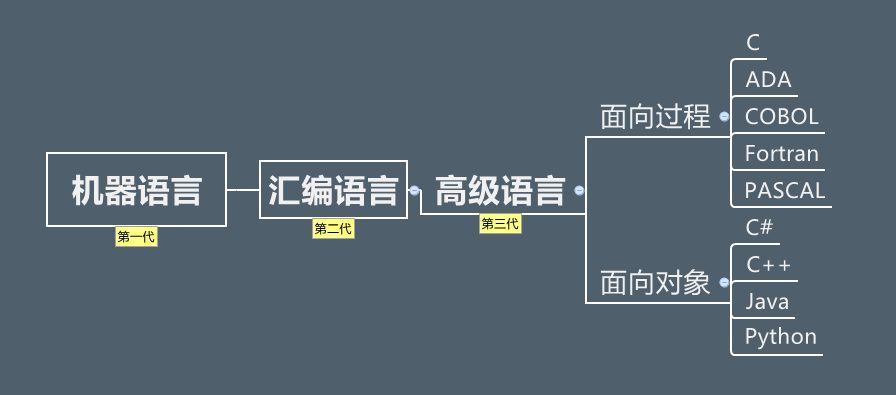

# java 背景

## Java的作者

james gosling（詹姆斯.高斯林)，1955年5月19日出生于加拿大，Java编程语言的共同创始人之一，一般公认他为“Java之父”。

##  **前言**

自1946年2月14日世界上首款计算机ENAC问世，第一代计算机语言“机器语言”便诞生了，它使用的是最原始的穿孔卡片，这种卡片上使用的语言只有专家才能理解，与人类语言差别极大。这种语言本质上是计算机能识别的唯一语言，人类很难理解。为了能让人们更容易理解并编写，于是便有了第二代的“汇编语言”，相比机器语言，汇编语言大大前进了一步，尽管它还是太复杂，人们在使用时很容易出错误，但毕竟许多数码已经开始用字母来代替。简单的“0、1”数码谁也不会理解，但字母是人们能够阅读并拼写的。虽然第二代计算机语言仍然是“面向机器”的语言，但它已注定成为机器语言向更高级语言进化的桥梁。当计算机语言发展到第三代时，就进入了“面向人类”的语言阶段。你可以阅读、并直接用人类的语言来输入。对我们汉语来说，目前还不能用中文汉字来输入指令，这主要是因为中文的输入还没有一个非常好的手段。第三代语言被人们称之为“高级语言”。高级语言是一种接近于人们使用习惯的程序设计语言。它允许用英文写计算程序，程序中所使用的运算符号和运算公式，都和我们日常用的数学公式差不多。高级语言容易学习，通用性强，书写出的程序比较短，便于推广和交流，是很理想的一种程序设计语言。我们学习的就是第三代语言“高级语言“中的Java语言。

## 诞生

​		20世纪90年代，硬件领域出现了单片机式计算机系统，这种价格低廉的系统一出现就立即引起了自动控制领域人员的注意，因为使用它可以大幅度提升消费类电子产品（例如：电视机顶盒、面包烤箱、移动电话等）的智能化进度。Sun公司为了抢占先机，在1991年成立了一个名为“Green”（类似于绿色软件的意思）的项目小组，James Gosling、Patrick Naughton、Michael Sheridan和其他几个同事们一起组成的工作小组在加利福尼亚州门洛帕克市沙丘路的一个小工作室里面开始研究开发新技术，专攻计算机语言在消费类电子产品上嵌入式应用。

　　由于C++所具有的优势，该项目组的研究人员首先考虑采用C++来编写程序。但对于硬件资源极其匮乏的单片式系统来说，C++所编写的程序过于庞大和复杂。另外由于消费类电子产品所采用的嵌入式处理器芯片的种类繁杂，如何让编写的程序跨平台运行也是个难题。为了解决困难，他们首先着眼于计算机语言的开发，假设了一种结构简单、符合嵌入式应用需要的硬件平台体系结构并为其制定了相应的规范，其中就定义了这种硬件平台的二进制机器码指令系统（即后来成为“字节码”的指令系统），以待语言开发成功后，能有半导体芯片生产商开发和生产这种硬件平台。对于新语言的设计，Sun公司研发人员并没有开发一种全新的语言，而是根据嵌入式软件的要求，对C++进行了改造，去除了C++上的一些不太实用及影响安全的成分，并结合嵌入式系统的实时性要求，开发出了一个名为“Oak”的面向对象语言。

　　由于在开发Oak语言时，尚且不存在运行字节码的硬件平台，所以为了在开发时可以对这种语言进行实验研究，他们就在己有的硬件和软件平台基础上，按照自己所指定的规范，用软件建设了一个运行平台，整个系统除了比C++更加简单之外，没有太大区别。1992年的夏天，当Oak语言开发成功后，研究者们向硬件生产商进行演示了Green操作系统、Oak程序设计语言、类库和其硬件，以说服他们对Oak语言生产硬件芯片，但是，硬件生产商并未对此产生极大的热情。因为他们认为，在所有人对Oak语言还是一无所知的情况下就贸然生产硬件产品的风险实在是太大了，所以Oak语言也就因此缺乏硬件的支持而无法进入市场，从而被搁置了下来。

　　1994年6、7月间，在经历了一场历时三天的讨论后，团队决定再一次改变努力的目标，这次他们决定将该技术应用于万维网上。他们认为随着Mosaic浏览器的到来，因特网正在向同样的高度互动的远景演变，而这一远景正是他们在有线电视网中看到的。作为原型，Patrick Naughton编写了一个小型万维网浏览器WebRunner。

　　1995年，互联网的蓬勃发展给了Oak机会。业界为了使死板、单调的静态页面能够“灵活”起来，急需一种软件技术来开发一种程序，这种程序可以通过网络传播并且能够跨平台运行。于是，世界各大IT企业为此纷纷投入了巨大的人力、物力与财力。这个时候，Sun公司想起了那个被搁置很久的Oak，并且重新审视了那个用软件编写的实验平台，由于它是按照嵌入式系统硬件平台体系结构所进行编写的，所以非常小，特色适用于网络上传输，而Oak也是一种精简的语言，程序非常小，适合在网络上传输。Sun公司首先推出了可以嵌入网页并且可以随同网页在网络上传输Applet（一种将小程序嵌入到网页中进行执行的技术），并将Oak更名为“Java”。从此一个即好听又好记、具有强大的生命力的编程语言Java便诞生了。

　　（在申请商标的时候也有这样一件趣事，Sun公司在申请Oak商标时发现Oak已经被别家公司使用了，所以James Gosling决定通过市场部门，请来了一个命名顾问，召开命名征集会。在命名征集会上，大家提出了很多名字。最后按大家的评选次序，将十几个名字排列成表，上报给商标律师。排在第一位的是Silk（丝绸）。尽管大家都喜欢这个名字，但遭到James Gosling的坚决反对而作罢。排在第二和第三的都没有通过律师这一关。James Gosling最喜欢的就是排在第三位的Lyric（抒情诗）。只有排在第四位的名字得到了所有人的认可和律师的通过，这个名字就是“Java”。那么是谁在命名征集会上提议叫“Java”的呢?Jame Gosling在接受采访时回忆道：“市场部组织了命名会，命名顾问主持了会议，我们喊叫着列出了一大堆名字。我记得第一个提议Java这个名字的是Mark Opperman”。Mark Opperman是在一家名叫“爪蛙咖啡”的咖啡店与同事品尝咖啡时得到灵感的。Java是印度尼西亚爪哇岛的英文名称，因盛产咖啡而闻名。国外的许多咖啡店用Java来命名或宣传，以彰显其咖啡的品质。Java语言中的许多库类名称，多与咖啡有关，如JavaBeans（咖啡豆）、NetBeans（网络豆）以及ObjectBeans （对象豆）等等。）

## java发展史
​	1990年初，最初被命名为Oak；

​	1995年5月23日，Java语言诞生，Sun在Sun World会议上正式发布Java语言和HotJava浏览器。IBM、Apple、DEC、Adobe、HP、Oracle、Netscape和Microsoft等各大公司都纷纷停止了自己的相关开发项目，竞相购买了Java使用许可证，并为自己的产品开发了相应的Java平台；

​	1996年1月，第一个JDK-JDK1.0诞生，Sun公司发布了Java的第一个开发工具包（JDK1.0），这是Java发展历程中的重要里程碑，标志着Java成为一种独立的开发工具；

​	1996年4月，10个最主要的操作系统供应商申明将在其产品中嵌入Java技术；

​	1996年9月，约8.3万个网页应用了Java技术来制作；

​	1996年10月，Sun公司发布了Java平台第一个即时编译器（JIT）；

​	1997年2月18日，JDK1.1发布，在随后的三周时间里，达到了22万次的下载量；

​	1997年4月2日，JavaOne会议召开，参与者逾一万人，创当时全球同类会议规模之纪录；

​	1997年9月，JavaDeveloperConnection社区成员超过十万；

​	1998年2月，JDK1.1被下载超过2,000,000次；

​	1998年12月8日，Java 2企业平台J2EE发布；

​	1999年6月，SUN公司发布Java三个版本：标准版（J2SE）、企业版（J2EE）和微型版（J2ME）；

​	2000年5月8日，JDK1.3发布；

​	2000年5月29日，JDK1.4发布，获得Apple公司Mac OS的工业标准的支持；

​	2001年6月5日，Nokia宣布到2003年将出售1亿部支持Java的手机；

​	2001年9月24日，J2EE1.3发布；

​	2002年2月26日，J2SE1.4发布，此后Java的计算能力有了大幅提升，与J2SE1.3相比，其多了近62%的类与接口。在这些新特性当中，还提供了广泛的XML支持、安全套接字（Socket）支持（通过SSL与TLS协议）、全新的I/OAPI、正则表达式、日历与断言；

​	2004年9月30日，J2SE1.5发布，成为Java语言发展史上的又一里程碑。为了表示该版本的重要性，为了表示这个版本的重要性，J2SE 1.5正式更名为Java SE 5.0（内部版本号：1.5.0），代号“Tiger”该版本是自1996年发布1.0版本以来最大的更新，其中包括泛型的支持、基本数据类型的自动装箱、改进的循环、枚举类型、格式化I/O及可变参数；

​	2005年6月，JavaOne大会召开，SUN公司公开Java SE 6。此时，Java的各种版本已经更名，以取消其中的数字“2”：J2EE更名为Java EE，J2SE更名为Java SE，J2ME更名为Java ME；

​	2006年12月，SUN公司发布JRE6.0；

​	2008年，SUN公司收购mysql；

​	2009年4月20日，Oracle宣布将以每股9.5美元的价格收购Sun，该交易的总价值约为74亿美元。但Oracle通过收购Sun公司获得了两项软件资产：Java和Solaris。于是曾经代表一个时代的公司：Sun倒下了，不过Java的大旗依然“猎猎”作响。2007年11月，Google宣布推出一款基于Linux平台的开源手机操作系统：Android。Android的出现顺应了即将出现的移动互联网潮流，而且Android系统的用户体验非常好，因此迅速成为手机操作系统的中坚力量。Android平台使用了Dalvik虚拟机来运行.dex文件，Dalvik虚拟机的作用类似于JVM虚拟机，只是它并未遵守JVM规范而已。Android使用Java语言来开发应用程序，这也给了Java语言一个新的机会。在过去的岁月中，Java语言作为服务器端编程语言，已经取得了极大地成功；而Android平台的流行，则让Java语言获得了在客户端程序上大展拳脚的机会；

​	2010年11月 由于甲骨文对Java社区的不友善，因此Apache扬言将退出JCP

​	2011年7月28日甲骨文发布Java SE 7，，这次版本升级经过了将近5年时间。Java 7也是Oracle发布的第一个Java版本，引入了二进制整数、支持字符串的switch语句、菱形语法、多异常捕捉、自动关闭资源的try语句等新特性。

​	2014年3月18日 甲骨文发表Java SE 8，这次版本升级为Java带来了全新的Lambda表达式。除此之外，Java 8还增加了大量新特性，这些新特性使得Java变得更加强大。

​	2017年9月22日 甲骨文发表Java SE 9，该版本支持：模块化（jiqsaw）、交互式命令行（JShell）、默认垃圾回收期切换为G1、进程操作改进、竞争锁性能优化、分段代码缓存和优化字符串占用空间等新特性。

​	2018年3月21日 甲骨文发表Java SE 10

​	2018年9月26日 甲骨文发表Java SE 11

​	2019年3月19日 甲骨文发表Java SE 12

​	2019年9月17日 Java SE 13 Text Blocks (Preview)

​	2020 3月18日 java14 正式发布

 目前Java的版本已经更新到14版本，但市场主流还是使用的JDK8。

springcloud

https://mvnrepository.com/

[springboot和springcloud版本对应关系](https://start.spring.io/actuator/info)

打开pom.xml，鼠标右击选择"Add as Maven Project" 即可