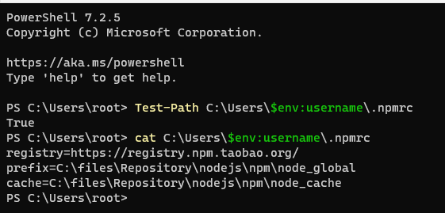
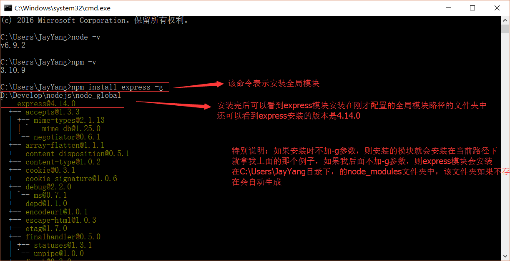

# 简介

1.Node.js是一个JavaScript运行时环境（可以解析和执行JavaScript代码）

2.现在的JavaScript可以完全脱离浏览器来运行，一切都归功于Node.js

3.浏览器中的JavaScript包括EcmaScript、BOM、DOM

4.Node.js中的JavaScript  ：没有BOM、DOM，用EcmaScript进行编码，主要是在Node这个JavaScript执行环境中为JavaScript提供一些服务器级别的API操作（例如文件读写、网络服务的构建、网络通信、http服务器等处理）

5.Node.js特性是 使用事件驱动、非阻塞IO模型(异步)，使得其轻量和高效

6.npm是基于Node.js开发出来的包管理工具，npm是世界上最大的开源库生态系统，绝大多数js相关的包都存放在npm上，方便开发人员下载使用

7.Google Chrome的V8引擎是目前公认的解析执行JavaScript代码最快的，Node.js构建在Google Chrome的V8引擎之上，是一个独立的JavaScript运行时环境

8.Node.js能做的事：Web服务器后台、命令行工具(npm、git、hexo)


# Windows环境
## 环境准备

1. 操作系统：win11
2. 命令行工具：powershell7.2.5
## 下载

在官方下载页面https://nodejs.org/en/download/，进行下载最新版本。产品开发建议使用LTS


## 安装

1. 同意安装协议

   

2. 选择安装目录

   

3. 自定安装内容

   

   > 这里的模块建议都选择：（entire feature will  on local hard drive）
   >
   > will be install on local hard drive：将安装在本地硬盘上
   > entire feature will  on local hard drive：整个功能将在本地硬盘上
   > will be install to run from network：将安装为从网络运行
   > entire feature will  on local hard drive：整个功能将从网络上运行
   > feature will  be install when required：功能将在需要时安装
   > entire  feature will be unavailable：功能将在需要时安装

4. 选择开发工具

   

   >这是在告诉我们，选择后，会自动安装2个工具：
   >
   >- 构建工具(Python 2和Visual Studio构建工具)
   >
   >- Chocolatey
   >
   >构建工具是因为一些npm模块需要使用C/C++编译，如果想要编译这些模块，则需要安装这个工具。如果不安装这个构建工具，在之后使用 npm 安装模块的时候，会报错：
   >
   >​		gyp ERR! find Python
   >
   >如果见到这个错误，知道是因为没有安装 构建工具。
   >
   >构建工具和 Chocolatey 都是必装的，如果现在没有安装，可以之后再手动安装，提示里已经给出了相关解释：https://github.com/nodejs/node-gyp#on-windows
   >
   >该提示还告诉你 Chocolatey 会在后面弹出一个 cmd 来安装。

   这里建议==不勾选安装==。因为python等工具，会与我们本地已安装的其它版本重复安装。

5. 确定安装

   

6. 安装进行中

   

7. 完成安装

   


## 验证安装


## npm

### 检查配置

```shell
#判断当前用户下.npmrc是否存在，若存在True。不存在则Flase
Test-Path C:\Users\$env:username\.npmrc

#若存在则建议将重命名备份
cd C:\Users\$env:username\
Get-ChildItem -path C:\Users\$env:username .npmrc |Rename-Item -NewName { 'bak_{1:yyyyMMddHHmmss}.npmrc ' -f ,$_.Basename,(Get-Date) }

#查看或移除配置
cat C:\Users\$env:username\.npmrc
rm C:\Users\$env:username\.npmrc

```


### 镜像配置

我们要知道node.js是一个JavaScript运行时环境，那我们做开发时，必然需要引用到第三方的组件包。这时候，我们就需要用到一个管理第三方组件包管理工具==npm==。Node.js已自带npm，安装Node.js时会一并安装，方便对第三方包的安装、升级与移除等管理。

既然npm对第三方组件包的进行安装，必然需要访问官方远端仓库下载包。然而npm默认仓库是国外，可想而知网络问题势必对安装有严重的影响。这时阿里造福，在国内构建了镜像源，方便我们程序员。

官方说明npm.taobao.org这是一个完整 npmjs.org 镜像，你可以用此代替官方版本(只读)，同步频率目前为 10分钟 一次以保证尽量与官方服务同步。																																				

```bash
#查看已配置的地址
npm config get registry
#设置为淘宝镜像(http://registry.npmjs.org )
npm config set registry https://registry.npm.taobao.org
#设置回官方默认仓库源地址：
npm config set registry https://registry.npmjs.org
```

如果你想在==保留==官方源的同时，又想==随时==使用淘宝源。你可以使用下面两种方法：

```bash
#一、在命令后添加仓库源参数
npm install -g [包名] --registry=https://registry.npm.taobao.org
#二、安装cnpm，需要使用淘宝源时，用cnpm代替npm执行命令
npm install -g cnpm --registry=https://registry.npm.taobao.org
```

### 环境配置


#### 文件夹准备

```shell
mkdir -p C:\files\Repository\nodejs\npm\node_global
mkdir -p C:\files\Repository\nodejs\npm\node_cache
```

#### 查看默认配置

##### 全局目录

> 在上一小节中你应该看到安装cnpm的命令中有一个==-g==参数，这个参数代表==全局安装==。如果把这个参数==移除==，则只会安装都==当前目录==下。

默认的全局安装路径，可以通过下面命令获取：

```bash
npm config get prefix
```


全局组件包，都会安装到，该目录中。

##### 缓存目录

既然包可以全局安装，也可以当前目录，那在==不同目录下进行安装相同的包==时，那岂不是每次都要从仓库下载？非也。npm为我们提供了一个==缓存目录==，所有通过npm安装的包都会缓存在此文件夹。这样npm安装包时，首先会在缓存目录判断是否已经存在，若不存在，再进行网络下载。

默认的缓存路径，可以通过下面命令获取：

```bash
npm config get cache
```


#### 自定义目录

一般情况下，以上两个目录建议都设置到非系统盘当中区。下面是我设置的路径：
```bash
#设置全局模块
npm config set prefix "C:\files\Repository\nodejs\npm\node_global"
#设置缓存路径
npm config set cache "C:\files\Repository\nodejs\npm\node_cache"
```
#### 环境变量

若按上面自定义了全局模块新路径，则我们也要重新设置环境变量，==不然==我们全局安装的命令，不能在任意目录下执行了。==故==我们需要将nodejs安装时设置的默认路径，修改成我们==新路径==。

以下是在win11环境下，设置的环境变量的方式：

1. 删除用户变量（该配置会设置到系统变量中）

   

2. 设置系统环境变量

   > 按图示，配置好NODE_PATH，NPM_PATH

   

#### 测试

配置完后，安装个module测试下，我们就安装最常用的express模块(基于 Node.js 平台，快速、开放、极简的 Web 开发框架)，打开cmd窗口，输入如下命令进行模块的全局安装：

```bash
npm install express -g     # -g是全局安装的意思
```



### 常用命令

```bash
npm list -g --dept 0
```


NPM是随同NodeJS一起安装的包管理工具，能解决NodeJS代码部署上的很多问题，常见的使用场景有以下几种：

- 允许用户从NPM服务器下载别人编写的第三方包到本地使用。

- 允许用户从NPM服务器下载并安装别人编写的命令行程序到本地使用。

- 允许用户将自己编写的包或命令行程序上传到NPM服务器供别人使用


```bash
#npm-check检查更新
npm install -g npm-check
npm-check
npm-check -u -g
#npm-upgrade更新
npm install -g npm-upgrade
npm-upgrade
#更新全局包：
npm update <name> -g
#更新生产环境依赖包：
npm update <name> --save
#更新开发环境依赖包：
npm update <name> --save-dev
npm install -g npm
```

# npx

>[Node.js中npx命令的使用方法、场景 - 虚伪渲染敷衍 - 博客园 (cnblogs.com)](https://www.cnblogs.com/fitzlovecode/archive/2021/08/02/learn_npx.html)

npx是一个工具，npm v5.2.0引入的一条命令（npx），一个npm包执行器，指在提高从npm注册表使用软件包时的体验 ，npm使得它非常容易地安装和管理托管在注册表上的依赖项，npx使得使用CLI工具和其他托管在注册表。它大大简化了一些事情。

就像npm极大地提升了我们安装和管理包依赖的体验，在npm的基础之上，npx让npm包中的命令行工具和其他可执行文件在使用上变得更加简单。它极大地简化了我们之前使用纯粹的npm时所需要的大量步骤。

主要特点：

1、临时安装可执行依赖包，不用全局安装，不用担心长期的污染。

2、可以执行依赖包中的命令，安装完成自动运行。

3、自动加载node_modules中依赖包，不用指定$PATH。

4、可以指定node版本、命令的版本，解决了不同项目使用不同版本的命令的问题。

# yarn

## Yarn是什么？

“Yarn是由Facebook、Google、Exponent 和 Tilde 联合推出了一个新的 JS 包管理工具 ，正如[官方文档](https://link.jianshu.com?t=http%3A%2F%2Flink.zhihu.com%2F%3Ftarget%3Dhttps%3A%2F%2Fcode.facebook.com%2Fposts%2F1840075619545360)中写的，Yarn 是为了弥补 npm 的一些缺陷而出现的。”这句话让我想起了使用npm时的坑了：

- `npm install`的时候**巨慢**。特别是新的项目拉下来要等半天，删除node_modules，重新install的时候依旧如此。
- 同一个项目，安装的时候**无法保持一致性**。由于package.json文件中版本号的特点，下面三个版本号在安装的时候代表不同的含义。

```shell
"5.0.3",
"~5.0.3",
"^5.0.3"
```

“5.0.3”表示安装指定的5.0.3版本，“～5.0.3”表示安装5.0.X中最新的版本，“^5.0.3”表示安装5.X.X中最新的版本。这就麻烦了，常常会出现同一个项目，有的同事是OK的，有的同事会由于安装的版本不一致出现bug。

- 安装的时候，包会在同一时间下载和安装，中途某个时候，一个包抛出了一个错误，但是npm会继续下载和安装包。因为npm会把所有的日志输出到终端，有关错误包的错误信息就会在一大堆npm打印的警告中丢失掉，并且你甚至永远**不会注意到实际发生的错误**。

带着这些坑，我开始了解Yarn的优势及其解决的问题。

## Yarn的优点？

- **速度快** 。速度快主要来自以下两个方面：

1. 并行安装：无论 npm 还是 Yarn 在执行包的安装时，都会执行一系列任务。npm 是按照队列执行每个 package，也就是说必须要等到当前 package 安装完成之后，才能继续后面的安装。而 Yarn 是同步执行所有任务，提高了性能。
2. 离线模式：如果之前已经安装过一个软件包，用Yarn再次安装时之间从缓存中获取，就不用像npm那样再从网络下载了。

- 安装**版本统一**：为了防止拉取到不同的版本，Yarn 有一个锁定文件 (lock file) 记录了被确切安装上的模块的版本号。每次只要新增了一个模块，Yarn 就会创建（或更新）yarn.lock 这个文件。这么做就保证了，每一次拉取同一个项目依赖时，使用的都是一样的模块版本。npm 其实也有办法实现处处使用相同版本的 packages，但需要开发者执行 npm shrinkwrap 命令。这个命令将会生成一个锁定文件，在执行 npm install 的时候，该锁定文件会先被读取，和 Yarn 读取 yarn.lock 文件一个道理。npm 和 Yarn 两者的不同之处在于，Yarn 默认会生成这样的锁定文件，而 npm 要通过 shrinkwrap 命令生成 npm-shrinkwrap.json 文件，只有当这个文件存在的时候，packages 版本信息才会被记录和更新。
- **更简洁的输出**：npm 的输出信息比较冗长。在执行 npm install <package> 的时候，命令行里会不断地打印出所有被安装上的依赖。相比之下，Yarn 简洁太多：默认情况下，结合了 emoji直观且直接地打印出必要的信息，也提供了一些命令供开发者查询额外的安装信息。
- **多注册来源处理：**所有的依赖包，不管他被不同的库间接关联引用多少次，安装这个包时，只会从一个注册来源去装，要么是 npm 要么是 bower, 防止出现混乱不一致。
- **更好的语义化**： yarn改变了一些npm命令的名称，比如 yarn add/remove，感觉上比 npm 原本的 install/uninstall 要更清晰。

### Yarn和npm命令对比

|                          npm | yarn                 |
| ---------------------------: | :------------------- |
|                  npm install | yarn                 |
|     npm install react --save | yarn add react       |
|   npm uninstall react --save | yarn remove react    |
| npm install react --save-dev | yarn add react --dev |
|            npm update --save | yarn upgrade         |

## npm的未来：npm5.0

有了yarn的压力之后，npm做了一些类似的改进。

1. 默认新增了类似yarn.lock的 package-lock.json；
2. git 依赖支持优化：这个特性在需要安装大量内部项目（例如在没有自建源的内网开发），或需要使用某些依赖的未发布版本时很有用。在这之前可能需要使用指定 commit_id 的方式来控制版本。
3. 文件依赖优化：在之前的版本，如果将本地目录作为依赖来安装，将会把文件目录作为副本拷贝到 node_modules 中。而在 npm5 中，将改为使用创建 symlinks 的方式来实现（使用本地 tarball 包除外），而不再执行文件拷贝。这将会提升安装速度。目前yarn还不支持。


# pnpm

[Benchmarks of JavaScript Package Managers | pnpm 中文文档 | pnpm 中文网](https://www.pnpm.cn/benchmarks)