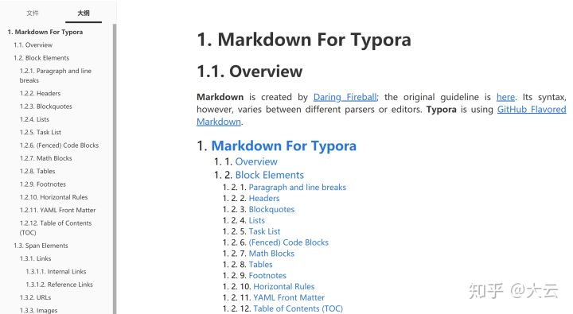
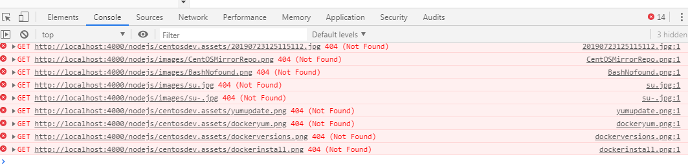

#  解决什么问题需要markdown

原来我们在记录笔记时通常是用word，或者更低级的txt。前者虽然可以编辑复杂的格式，但是为了将笔记的格式或样式排版的更美观，需要花掉我们大量的时间。后者不仅不能存放笔记图片，而且所有文字只能都是一个字体，内容更是没有主次和顺序之分。

而我们记笔记的目的，是着重于笔记内容本身，而非排版。

所以我们希望有能通过一个手段或者一个编辑工具，来实现我们。而Markdown应运而生，Markdown用简洁的语法代替排版，其是一种轻量级的标记语言，而我们使用的就是Typora 编辑器。

所有知识库内容将用markdown标记语言编写，并用gitbook生成html在线教程，上传至CentOS服务器通过nginx访问。

# markdown
## 简介

Markdown是一种轻量级的标记语言，它允许人们使用易读易写的纯文本格式编写文档，借助可实现快速排版且转换成格式丰富的HTML页面。目前被越来越多的写作爱好者及工作者使用。其语法十分简单，常用标记符号少，学习时间少，一旦掌握这种标记语言，将极大提高效率。但是若需要复杂排版如左右对齐缩进等，还是选择word等专业软件。

Markdown用简洁的语法代替排版，而不像常用文字处理软件*Word*或*Pages*等进行排版、字体、插入等设置。标记语言可以通过键盘即实现字体大小、插入表格，图片，超链接，脚注等。

Markdown的优点

最大好处是：快速掌握。

简单，适合所有人群，方便打开，不至于出现低版本word打不开高版本word的文档。

避免软件不同，如对方是wps，看到的word文档效果和你不一样。

方便快速排版，节省时间。

轻松的导出为HTML、PDF格式。

纯文本内容，兼容所有的文本编辑器与文字处理软件。

支持Markdown语法的编辑器有很多，部分网站也支持。

## 编写工具


这里我推荐使用typora，因为它可以所以见即所得，不会像他编辑工具一样，左边编辑，右边预览。

## 语法

[语法学习](https://www.runoob.com/markdown) 							[《了不起的Markdown》](https://item.jd.com/12669274.html)

## 个人体会

markdown让我们程序员，在记录知识时省却了排版所浪费的时间，而且支持代码块，流程图等。在word上程序代码不支持高亮，而且排版格式不适宜代码显示等。而markdown会让你心情愉悦，只需在编辑内容上用心即可。

## Typora 标题自动编号

Typora其实是将markdown转换成html展示给我们看的，而且默认层级显示是没有序号，只有字体大小。所以我们需要通过css让其显示序号，让笔记更有层次感。




在主题文件夹下开创建base.user.css文件，复制粘贴一下css样式代码：

```css
/** initialize css counter */
#write {
    counter-reset: h1
}

h1 {
    counter-reset: h2
}

h2 {
    counter-reset: h3
}

h3 {
    counter-reset: h4
}

h4 {
    counter-reset: h5
}

h5 {
    counter-reset: h6
}

/** put counter result into headings */
#write h1:before {
    counter-increment: h1;
    content: counter(h1) ". "
}

#write h2:before {
    counter-increment: h2;
    content: counter(h1) "." counter(h2) ". "
}

#write h3:before,
h3.md-focus.md-heading:before /** override the default style for focused headings */ {
    counter-increment: h3;
    content: counter(h1) "." counter(h2) "." counter(h3) ". "
}

#write h4:before,
h4.md-focus.md-heading:before {
    counter-increment: h4;
    content: counter(h1) "." counter(h2) "." counter(h3) "." counter(h4) ". "
}

#write h5:before,
h5.md-focus.md-heading:before {
    counter-increment: h5;
    content: counter(h1) "." counter(h2) "." counter(h3) "." counter(h4) "." counter(h5) ". "
}

#write h6:before,
h6.md-focus.md-heading:before {
    counter-increment: h6;
    content: counter(h1) "." counter(h2) "." counter(h3) "." counter(h4) "." counter(h5) "." counter(h6) ". "
}

/** override the default style for focused headings */
#write>h3.md-focus:before,
#write>h4.md-focus:before,
#write>h5.md-focus:before,
#write>h6.md-focus:before,
h3.md-focus:before,
h4.md-focus:before,
h5.md-focus:before,
h6.md-focus:before {
    color: inherit;
    border: inherit;
    border-radius: inherit;
    position: inherit;
    left:initial;
    float: none;
    top:initial;
    font-size: inherit;
    padding-left: inherit;
    padding-right: inherit;
    vertical-align: inherit;
    font-weight: inherit;
    line-height: inherit;
}


/*左侧大纲目录序号*/
.sidebar-content {
    counter-reset: h1
}

.outline-h1 {
    counter-reset: h2
}

.outline-h2 {
    counter-reset: h3
}

.outline-h3 {
    counter-reset: h4
}

.outline-h4 {
    counter-reset: h5
}

.outline-h5 {
    counter-reset: h6
}

.outline-h1>.outline-item>.outline-label:before {
    counter-increment: h1;
    content: counter(h1) ". "
}

.outline-h2>.outline-item>.outline-label:before {
    counter-increment: h2;
    content: counter(h1) "." counter(h2) ". "
}

.outline-h3>.outline-item>.outline-label:before {
    counter-increment: h3;
    content: counter(h1) "." counter(h2) "." counter(h3) ". "
}

.outline-h4>.outline-item>.outline-label:before {
    counter-increment: h4;
    content: counter(h1) "." counter(h2) "." counter(h3) "." counter(h4) ". "
}

.outline-h5>.outline-item>.outline-label:before {
    counter-increment: h5;
    content: counter(h1) "." counter(h2) "." counter(h3) "." counter(h4) "." counter(h5) ". "
}

.outline-h6>.outline-item>.outline-label:before {
    counter-increment: h6;
    content: counter(h1) "." counter(h2) "." counter(h3) "." counter(h4) "." counter(h5) "." counter(h6) ". "
}

mark {
    background: white;
    color: red;
    font-weight: bold;
    border-bottom: 0px solid white;
    padding: 0.0px;
    margin: 0 0px;
  }

::selection { background-color: Lime; color: red;}
```
# gitbook

> [gitbook安装与使用（含常用插件和book.json配置详解）](https://blog.csdn.net/fghsfeyhdf/article/details/88403548)

是什么？

在我认识 GitBook 之前，我已经在使用 Git 了，毋容置疑，Git 是目前世界上最先进的分布式版本控制系统。

我认为 Git 不仅是程序员管理代码的工具，它的分布式协作方式同样适用于很多场合，其中一个就是写作（这会是一个引起社会变革的伟大的工具！）。所以在我发现 GitBook 之前，实际上我已经无数次想象过它的使用场景了。

咋一看 GitBook 的名字，你可能会认为它是关于 Git 的一本书。而当你有所了解之后，你也许会认为它是一个使用 Git 构建电子书的工具。其实不然，GitBook 与 Git 的关系，就像雷锋塔和雷锋那样，没有一点关系！
实际上，GitBook 是一个基于 Node.js 的命令行工具，支持 Markdown 和 AsciiDoc 两种语法格式，可以输出 HTML、PDF、eBook 等格式的电子书。所以我更喜欢把 GitBook 定义为文档格式转换工具。

所以，GitBook 不是 Markdown 编辑工具，也不是 Git 版本管理工具。市面上我们可以找到很多 Markdown 编辑器，比如 Typora、MacDown、Bear、MarkdownPad、MarkdownX、JetBrains’s IDE（需要安装插件）、Atom、简书、CSDN 以及 GitBook 自家的 GitBook Editor 等等。

## 安装 gitbook 

GitBook 是一个基于 Node.js 的命令行工具，下载安装 [Node.js](https://links.jianshu.com/go?to=https%3A%2F%2Fnodejs.org%2Fen)，安装完成之后，你可以使用下面的命令来检验是否安装成功。

注意Node.js 对Gitbook存在兼容问题，截止2020年10月17日，LST版本为12.18.4，最新版13.9.0。建议用LTS版本。

在https://nodejs.org/en/download/releases/中，可以查看所有Node.js版本。

```bash
$ node -v
v12.18.4
```

确认安装完node.js后再执行一下命令

```bash
npm install gitbook-cli -g  
#或者（yarn类似于npm安装方式，具体参考node.js章节）
yarn global add gitbook-cli
```

## 验证安装

```bash
gitbook -V
```

注意：若输入上面命令后，提示Installing GitBook，时间较长，请耐心等待。


## 初使化目录

```bash
gitbook init
```

会发现目录下面多了2个文件，**README.md**和**SUMMARY.md**

README.md 和 SUMMARY.md 是两个必须文件

README.md 是对书籍的简单介绍

SUMMARY.md 是书籍的目录结构


## 生成

```bash
#生成在当前目录的默认文件夹 _book里面
gitbook build   
#生成在当前目录的默认文件夹 指定的out 里面
gitbook build  ./out      
#当前除文件夹md外，生成到out文件夹中  
gitbook build  ./md  ./out  
```

## 本地预览

```bash
#注意server没有r。默认端口4000
gitbook serve --port 8088
```

[http://localhost:4000](http://localhost:4000/)

## 配置文件（不是必需的）

在目录下创建book.json文件，json对象在使用过成中，不允许注释，请复制粘贴后删除注释部分。

```json
{
	"title": "前端规范",
	"description": "前端规范 简介",
	"language": "zh-hans",
	"plugins": [
		"-lunr", 
		"-search", 
        "code",					   //代码行号插件和复制
		"search-plus",             //支持中文搜索  上面 search 是默认的   “-”  是去掉的意思
		"splitter",                // 这个侧边可以拉伸
		"tbfed-pagefooter",        //这个是底部加 信息  下面可以看到具体的配置
		"expandable-chapters-small"//使左侧的章节目录可以折叠
        "page-treeview",		   //页面头部目录
		"page-toc-button",		   //右侧悬浮目录导航
		"icp"					   //备案信息
	],
	"pluginsConfig": {
        "theme-default": {
	        "showLevel": true
	    },
	    "tbfed-pagefooter": {
	        "copyright":"Copyright &copy xxxxx",
	        "modify_label": "该文件修订时间：",
	        "modify_format": "YYYY-MM-DD HH:mm:ss"
	    },
        "page-treeview": {
            "copyright": "Copyright &#169; aleen42",
            "minHeaderCount": "2",
            "minHeaderDeep": "2"
        },
        "page-toc-button": {
            "maxTocDepth": 2,
            "minTocSize": 2
         },
        "icp": {
            "label": "",
            "number": "浙ICP备18042346号",
            "link": "http://beian.miit.gov.cn/",
            "style": {
              "color":  "#f72b07"
          }
	},
	"links": {
		"gitbook": false,
		"sharing": {
			"google": false,
			"facebook": false,
			"twitter": false,
			"all": false
		}
	}
}
```

上面配置好后，启动服务会报错，这样需要我们安装gitbook插件


## gitbook插件

*[gitbook仓库](https://www.npmjs.com/)*（使用gitbook-plugin-{插件名称}关键字搜索） 	 [常用插件](https://www.jianshu.com/p/427b8bb066e6)

```bash
#插件只要在第6节描述的json中配置好后，再执行该命令，就会自动安装（太慢）
gitbook install
```


```bash
#推荐使用（会使用nodejs镜像安装）
npm install gitbook-plugin-{插件名称}
```

【提醒】因为gitbook项目不是标准的nodejs项目，所以安装会出现如下图警告，请不要理会。


安装的插件都在当前目录下的node_modules文件夹下


```bash
#所以可以插件目录下按需删除，对插件卸载。也可将整个文件夹删除卸载。
rmdir /s/q  node_modules\
```

## 卸载GitBook

```bash
rmdir /s/q C:\Users\{User}\.gitbook #找到并删除此文件夹
```

删除后执行命令

```shell
npm uninstall -g gitbook
npm uninstall -g gitbook-cli
# 清除npm缓存
npm cache clean --force
```

## 常用命令

```bash
gitbook init //初始化目录文件
gitbook help //列出gitbook所有的命令
gitbook --help //输出gitbook-cli的帮助信息
gitbook build //生成静态网页
gitbook serve //生成静态网页并运行服务器
gitbook build --gitbook=2.0.1 //生成时指定gitbook的版本, 本地没有会先下载
gitbook ls //列出本地所有的gitbook版本
gitbook ls-remote //列出远程可用的gitbook版本
gitbook fetch 标签/版本号 //安装对应的gitbook版本
gitbook update //更新到gitbook的最新版本
gitbook uninstall 2.0.1 //卸载对应的gitbook版本
gitbook build --log=debug //指定log的级别
gitbook builid --debug //输出错误信息
```

## 关于目录插件

因为我们标题序号都是通过css自动生成，所以我们gitbook构建出的html，标题及目录也要用css生成编号。故我们要在项目目录下创建styles/website.css文件夹及文件，这样构建后，html会自动引用该样式。

```css
/*隐藏page-treeview目录的版权信息*/
.treeview__container-title{
    display: none;
}
/*给头部目录增加编号*/
.markdown-section li {counter-increment:a 1;}  
.markdown-section li a:before{content:counter(a)". ";}  
.markdown-section li li {counter-increment:b 1;}  
.markdown-section li li a:before{content:counter(a)"."counter(b)". ";}  
.markdown-section li li li {counter-increment:c 1;}  
.markdown-section li li li a:before{content:counter(a)"."counter(b)"."counter(c)". ";}
.markdown-section li li li li {counter-increment:d 1;}  
.markdown-section li li li li a:before{content:counter(a)"."counter(b)"."counter(c)"."counter(d)". ";}
/*给悬浮目录增加编号*/
.page-toc-menu li {counter-increment:toca 1;}  
.page-toc-menu li a:before{content:counter(toca)". ";}  
.page-toc-menu ul ul li {counter-increment:tocb 1;}  
.page-toc-menu ul ul li a:before{content:counter(toca)"."counter(tocb)". ";}  
/*给标题增加编号*/
.markdown-section { counter-reset: h1}
h1 {counter-reset: h2}
h2 {counter-reset: h3}
h3 {counter-reset: h4}
h4 {counter-reset: h5}
h5 {counter-reset: h6}
.markdown-section h1:before {counter-increment: h1; content: counter(h1) ". ";}
.markdown-section h2:before {counter-increment: h2; content: counter(h1) "." counter(h2) ". "}
.markdown-section h3:before {counter-increment: h3;content: counter(h1) "." counter(h2) "." counter(h3) ". "}
.markdown-section h4:before {counter-increment: h4; content: counter(h1) "." counter(h2) "." counter(h3) "." counter(h4) ". "}
.markdown-section h5:before {counter-increment: h5; content: counter(h1) "." counter(h2) "." counter(h3) "." counter(h4) "." counter(h5) ". "}
.markdown-section h6:before {counter-increment: h6; content: counter(h1) "." counter(h2) "." counter(h3) "." counter(h4) "." counter(h5) "." counter(h6) ". "}

p {text-indent:2em}  

mark {
    background: white;
    color: red;
    font-weight: bold;
    border-bottom: 0px solid white;
    padding: 0.0px;
    margin: 0 0px;
  }

::selection { background-color: Lime; color: red;}
```


## 问题

### 问题（warn"options"）


该问题经过排除法和网络上类似问题描述，应该是所使用的插件版本自身某些语法规则不是最新的导致。

### 问题（第一个h1生成不了页面目录）

需要首行空一行


### 问题（gitbook部署后相对路径资源文件404问题）



这种资源文件提示404错误请忽略，这是因为gitbook布局不是用iframe，所以资源文件会在页面加载完后，js会再处理相对路径的资源文件。

### 构建或启动时报错


如果出现类似这样的错误，就删除_book文件夹，重新执行命令即可。

### gitbook install 报错


