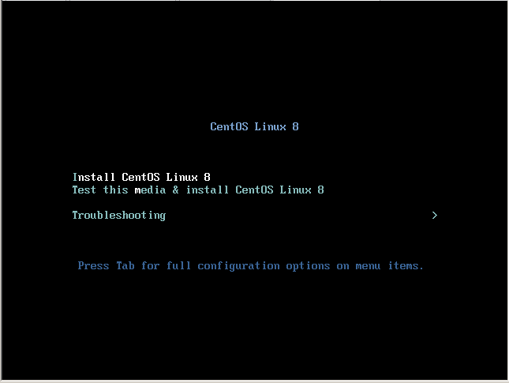
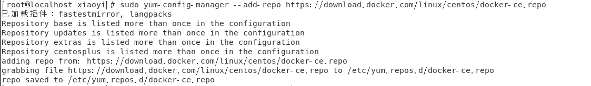

**※：所有命令通常是基于cd ~ 目录进行（即 ==当前用户目录== ）。除非有特殊说明，如“前后通过cd切换了目录”或“示例图片中明示了路径"。切记CentOS ==区分大小写==，而Windows不区分**。

# CentOS8 

## 简介

CentOS，是基于 Red Hat Linux 提供的可自由使用源代码的企业级 Linux 发行版本；是一个稳定，可预测，可管理和可复制的免费企业级计算平台。

|     功能     |          CentOS 8           |             CentOS 7             |
| :----------: | :-------------------------: | :------------------------------: |
|   内核版本   |          4.18.0-x           |             3.10.0-x             |
|   文件系统   |             XFS             |               XFS                |
|   时间同步   |        只支持Chronyd        |         支持NTP和Chronyd         |
|   文件大小   |             8EB             |              500TB               |
| 文件系统大小 |             1PB             |              500TB               |
|  包管理工具  |        DNF（YUM v4）        |          YUM（YUM v3）           |
|   最大内存   |            24TB             |               12TB               |
|    防火墙    |    nftables取代iptables     |    firewalld底层使用iptables     |
|   支持架构   |       支持64-bit ARM        |         不支持64-bit ARM         |
|   网络管理   |       默认安装Cockpit       |            无默认安装            |
|   CPU日志    | CPU日志记录在journald进程中 | CPU相关日志位于/var/log/cups目录 |
|   发布时间   |         2019-09-24          |            2014-07-07            |
|   完整更新   |         2024-05-01          |            2020-08-06            |
|   支持IPv6   |            支持             |        Ready Logo Phase 2        |
|     Git      |            2.18             |               1.7                |
|     GCC      |            8.2.1            |              4.8.5               |
|    Python    |            3.6.6            |              2.7.5               |
|    Glibc     |            2.28             |               2.17               |
|    Boost     |            1.66             |               1.53               |
|  LLVM/Clang  |             6.0             |               5.0                |

## 安装

因为我们是搭建服务器环境我们再安装过程中选择最小安装，后续需要应用到的软件，我们按需安装。使我们的服务器占用硬件资源最少。



我们输入Chinese关键字，选择到中文语言


务必先将网络打开，因为后续进入系统时，安装软件都需要网络。避免因网络未打开，安装完系统进入后，还手动配置网络。


安装过程中我们可以设置root密码和创建用户。


查看CentOS的IP，方便XShell登录使用


## 系统目录结构说明


## 安装基础软件

因为我们选择的是最小安装，很多系统工具没有安装，导致很多命令没法使用，如ifconfig，vim，wget等


```bash
#解决ifconfig
yum -y install net-tools
#解决vim(vi是所有UNIX系统都会提供的屏幕编辑器，也有的称为多模式编辑器，它提供了一个视窗设备，通过它可以编辑文件，而vim则是vi的升级版本，它不仅兼容vi的所有指令，而且还有一些新的特性在里面。如vim可以用不同的颜色来加亮你的代码、在vi里，按 u只能撤消上次命令，而在vim里可以无限制的撤消。)
yum -y install vim
#解决wget(非要说区别的话，curl由于可自定义各种请求参数所以在模拟web请求方面更擅长；wget由于支持ftp和Recursive所以在下载文件方面更擅长。类比的话curl是浏览器，而wget是迅雷9。)
yum -y install wget
#解决yum-config-manager命令找不到（使用yum-config-manager命令可以进行YUM配置管理）
yum -y install yum-utils
#常用软件
yum install wget vim yum-utils net-tools telnet nmap sysstat lrzsz dos2unix bind-utils -y
```


## 安装epel

**EPEL** (Extra Packages for Enterprise Linux)是基于Fedora的一个项目，为“红帽系”的操作**系统提供额外的软件包**，适用于RHEL、CentOS和Scientific Linux.

```bash
yum install epel-release
```

## 配置系统镜像源

*[镜像配置参考](https://developer.aliyun.com/mirror/centos?spm=a2c6h.13651102.0.0.3e221b11ItV0Mm)*

考虑到镜像源可以多次配置，建议备份文件后加上年月日。

```bash
#0. 查看本地镜像源信息
cat /etc/yum.repos.d/CentOS-Base.repo

#1. 备份
mv /etc/yum.repos.d/CentOS-Base.repo /etc/yum.repos.d/CentOS-Base.repo.backup


#2. 下载新的 CentOS-Base.repo 到 /etc/yum.repos.d/

#    CentOS 6
wget -O /etc/yum.repos.d/CentOS-Base.repo http://mirrors.aliyun.com/repo/Centos-6.repo
# 		或者
curl -o /etc/yum.repos.d/CentOS-Base.repo http://mirrors.aliyun.com/repo/Centos-6.repo

#    CentOS 7
wget -O /etc/yum.repos.d/CentOS-Base.repo http://mirrors.aliyun.com/repo/Centos-7.repo
# 		或者
curl -o /etc/yum.repos.d/CentOS-Base.repo http://mirrors.aliyun.com/repo/Centos-7.repo

#    CentOS 8
wget -O /etc/yum.repos.d/CentOS-Base.repo http://mirrors.aliyun.com/repo/Centos-8.repo
# 		或者
curl -o /etc/yum.repos.d/CentOS-Base.repo http://mirrors.aliyun.com/repo/Centos-8.repo


#运行 yum makecache 生成缓存
yum makecache
```


## 升级内核

### 查看版本

```shell
#查看当前内核版本
uname -r
#查看系统版本
cat /etc/redhat-release 
```

### 启用 ELRepo 仓库

ELRepo 仓库是基于社区的用于企业级 Linux 仓库，提供对 RedHat Enterprise (RHEL) 和 其他基于 RHEL的 Linux 发行版（CentOS、Scientific、Fedora 等）的支持。
ELRepo 聚焦于和硬件相关的软件包，包括文件系统驱动、显卡驱动、网络驱动、声卡驱动和摄像头驱动等。

```shell
#导入ELRepo仓库的公共密钥
rpm --import https://www.elrepo.org/RPM-GPG-KEY-elrepo.org
#安装ELRepo仓库的yum源
	#centos8
yum install https://www.elrepo.org/elrepo-release-8.el8.elrepo.noarch.rpm
	#centos7
yum install https://www.elrepo.org/elrepo-release-7.el7.elrepo.noarch.rpm
```

### 查看可用的系统内核包

在https://www.kernel.org/上可以查看最新核心

```bash
yum --disablerepo="*" --enablerepo="elrepo-kernel" list available
```

### 安装最新版本内核

```
yum --enablerepo=elrepo-kernel install kernel-ml
```

`--enablerepo` 选项开启 CentOS 系统上的指定仓库。默认开启的是 `elrepo`，这里用 `elrepo-kernel` 替换。

启动后选择最新的内核版本

### 验证

```bash
uname -r
```

### 删除旧内核

```bash
#查看系统中全部的内核：
rpm -qa | grep kernel
#删除老内核以及内核工具
rpm -qa|grep kernel|grep 3.10
rpm -qa|grep kernel|grep 3.10|xargs yum remove -y

```

### 安装新版本工具包

```bash
yum --disablerepo=\* --enablerepo=elrepo-kernel install -y kernel-ml-tools.x86_64
```

http://elrepo.org/tiki/tiki-index.php

https://www.cnblogs.com/xzkzzz/p/9627658.html

## 常用命令

### 网络配置

```bash
#配置网卡信息
vim /etc/sysconfig/network-scripts/ifcfg-ens33
#重启网络服务
systemctl restart network
#修改主机名
hostnamectl set-hostname <hdss7-200.host.com主机名>
#查看主机名
hostname
```

### 关闭SELinux

安全增强型 Linux（Security-Enhanced Linux）简称 SELinux，它是一个 Linux 内核模块，也是 Linux 的一个安全子系统。

SELinux 主要由美国国家安全局开发。2.6 及以上版本的 Linux 内核都已经集成了 SELinux 模块。

SELinux 的结构及配置非常复杂，而且有大量概念性的东西，要学精难度较大。很多 Linux 系统管理员嫌麻烦都把 SELinux 关闭了。

如果可以熟练掌握 SELinux 并正确运用，我觉得整个系统基本上可以到达"坚不可摧"的地步了（请永远记住没有绝对的安全）。

掌握 SELinux 的基本概念以及简单的配置方法是每个 Linux 系统管理员的必修课。

```bash
#将SELINUX=enforcing改为SELINUX=disabled
vim etc/selinux/config
#查看状态
getenforce
```

### 防火墙

```bash
#查看防火墙状态
systemctl status firewalld
#停止防火墙
systemctl stop firewalld
```


*[CentOS7 常用命令集合](https://www.cnblogs.com/shaosks/p/9150917.html)*

启动一个服务：systemctl start nginx.service

关闭一个服务：systemctl stop postfix.service

重启一个服务：systemctl restart nginx.service

显示一个服务的状态：systemctl status postfix.service

在开机时启用一个服务：systemctl enable nginx.service

在开机时禁用一个服务：systemctl disable nginx.service

查看服务是否开机启动：systemctl is-enabled nginx.service

查看已启动的服务列表：systemctl list-unit-files|grep enabled

查看启动失败的服务列表：systemctl --failed

 

free -h 查看内存使用情况

df -hl 查看磁盘剩余空间 

df -h 查看每个根路径的分区大小 

du -sh [目录名] 返回该目录的大小 

du -sm [文件夹] 返回该文件夹总M数 

du -h [目录名] 查看指定文件夹下的所有文件大小（包含子文件夹）

查看硬盘的分区 #sudo fdisk -l

查看IDE硬盘信息 #sudo hdparm -i /dev/hda

查看STAT硬盘信息 #sudo hdparm -I /dev/sda 或 #sudo apt-get install blktool #sudo blktool /dev/sda id

查看硬盘剩余空间 #df -h #df -H

查看目录占用空间 #du -hs 目录名

优盘没法卸载 #sync fuser -km /media/usbdisk

## 疑问

### su命令与su - 命令的区别

#### 切换root身份不同

su命令：su只是切换了root身份，但Shell环境仍然是普通用户的Shell；而su -连用户和Shell环境一起切换成root身份了。只有切换了Shell环境才不会出现PATH环境变量错误，报command not found的错误。

su - 命令：su切换成root用户以后，pwd一下，发现工作目录仍然是普通用户的工作目录；而用su -命令切换以后，工作目录变成root的工作目录了。

#### 采用su deploy命令后，取目标用户不同

su命令：su不会读取目标用户的环境配置文件，如图。


su - 命令：su - 读取目标用户的环境配置文件，如图。


综上总结：有“-”和无“-”各自的环境变量不同。

#### service命令

su命令：使用 su root 切换到root用户后，不可以使用service命令；

su - 命令：使用 su - 后，就可以使用service命令了。

#### 用echo $PATH命令后，环境量不同

su命令：环境量变为usr。

2、su - 命令：环境量变为oracle。

## 待整理或学习

[Linux软件安装管理之——RPM与YUM详解](https://www.jianshu.com/p/d021380f6d02)


# Docker&Docker-compose的安装

## docker

### 简介

Docker 是一个开源的应用容器引擎，让开发者可以打包他们的应用以及依赖包到一个可移植的镜像中，然后发布到任何流行的 Linux或Windows 机器上，也可以实现虚拟化。容器是完全使用沙箱机制，相互之间不会有任何接口。

### 安装准备

切换至root用户&确认CentOS的内核&更新CentOS

```bash
#切换至root
su root
#确认内核
uname -r
#系统更新
yum update
```


### 添加docker的yum源管理配置

国内建议是阿里源，官方源为https://download.docker.com/linux/centos/docker-ce.repo

```bash
yum-config-manager --add-repo http://mirrors.aliyun.com/docker-ce/linux/centos/docker-ce.repo
```


### 查看docker-ce各个版本

```shell
yum list docker-ce --showduplicates|sort -r
```


### 安装docker-ce

```shell
 yum install docker-ce
```

命令不标注版本号，则按照last版本。（若安装不成功，请参考下一小节解决）


### Centos8提示错误信息


这个是要求提前安装必要的***containerd.io***

```bash
yum list containerd.io  --showduplicates|sort -r
yum install https://download.docker.com/linux/fedora/30/x86_64/stable/Packages/containerd.io-1.2.6-3.3.fc30.x86_64.rpm
```


我们看到直接这样的查询***containerd.io***版本都低于必要版本（如果有当然更好，直接使用  **yum install -y containerd.io** 安装即可），所以我们要去看阿里镜像里最新的版本

https://mirrors.aliyun.com/docker-ce/linux/centos/7/x86_64/stable/Packages/


### 常用命令

查看版本：docker -v

查看镜像：docker images

查看容器：docker ps

 

启动 docker 服务：systemctl start docker

停止 docker 服务：systemctl stop docker 

重启 docker 服务：systemctl restart docker

进入一个运行中的容器：docker exec -it xx /bin/bash (xx可以是Id也可以是Name)

 

※注：使用非root用户启用或链接docker会提示权限被拒绝，所以需要切换至root用户或者sudo或者按下面说明加入docker组

默认情况下，docker 命令会使用 Unix socket 与 Docker 引擎通讯。而只有 root 用户和 docker 组的用户才可以访问 Docker 引擎的 Unix socket。出于安全考虑，一般 Linux 系统上不会直接使用 root 用户。因此，更好地做法是将需要使用 docker 的用户加入 docker 用户组。

建立docker组： sudo groupadd docker

将当前用户添加到docker组中：sudo usermod -aG docker $USER

## Docker-Compose安装

### 简介

Docker Compose是 docker 提供的一个命令行工具，用来定义和运行由多个容器组成的应用。使用 compose，我们可以通过 YAML 文件声明式的定义应用程序的各个服务，并由单个命令完成应用的创建和启动。

### 安装（两种安装）

#### 下载安装方式

通过 curl命令https://github.com/docker/compose/releases获取最新安装包。并将下载的文件通过chmod +x赋予可执行权限


```shell
#下载并解压，可以将下面命令的版本号替换成最新的即可直接使用
curl -L https://github.com/docker/compose/releases/download/1.25.5/docker-compose-`uname -s`-`uname -m` -o /usr/local/bin/docker-compose
#赋予可执行权限
chmod +x /usr/local/bin/docker-compose
```


####  pip安装方式

https://www.cnblogs.com/felixqiang/p/11946644.html

### 验证安装

```bash
#测试安装 
sudo docker-compose --version
```


### 详解Docker-Compose.yml文件

https://www.jianshu.com/p/ba77c7bdf03e

## 安装gitlab

### Docker安装gitlab

#### 在DockerHub上搜索中文版本GitLab镜像

现在新版本gitlab新版官方已支持本地化（中文），所以不需要在pull非官方中文版本

https://hub.docker.com/             search          gitlab/gitlab-ce


#### Pull GitLab镜像到本地


#### 使用docker-compose启动gitlab容器

在/usr/local/docker/gitlab/目录下创建 docker-compose.yml


> docker-compose.yml

```yaml
version: '3'
services:
    gitlab:
      image: 'gitlab/gitlab-ce' #镜像名称
      container_name: 'gitlab'  #自定义容器名称
      restart: unless-stopped
      hostname: '172.16.16.4' 	#内网地址
      environment:
        TZ: 'Asia/Shanghai'
        GITLAB_OMNIBUS_CONFIG: |
          external_url 'http://182.61.150.130'
          gitlab_rails['gitlab_shell_shh_port'] = 2222
          unicorn['port']=8888
          nginx['listen_port']=80
          gitlab_rails['smtp_enable'] = true
          gitlab_rails['smtp_address'] ='smtp.wo.cn'
          gitlab_rails['smtp_port'] = 465
          gitlab_rails['smtp_user_name'] = '13048818693@wo.cn'
          gitlab_rails['smtp_password'] = '邮箱密码'
          gitlab_rails['smtp_domain'] = 'wo.cn'
          gitlab_rails['smtp_authentication'] = 'login'
          gitlab_rails['smtp_enable_starttls_auto'] = true
          gitlab_rails['smtp_tls'] = true
          gitlab_rails['gitlab_email_from'] = '13048818693@wo.cn'
          gitlab_rails['gitlab_email_reply_to'] = '13048818693@wo.cn'      
      ports:
        - '80:80'
        - '8443:443'
        - '2222:22'
      volumes:
        - /usr/local/docker/gitlab/config:/etc/gitlab
        - /usr/local/docker/gitlab/data:/var/opt/gitlab
        - /usr/local/docker/gitlab/logs:/var/log/gitlab
      deploy:
        resources:
          limits:
            memory: 1.5G
          reservations:
            memory: 0.5G 
```


使用docker-compose up -d命令启动容器（建议修改配置后第一次启动使用docker-compose up启动 这样可以看到会不会报错）


#### 测试邮件


#### 附加

https://docs.gitlab.com/omnibus/settings/smtp.html

https://docs.docker.com/compose/compose-file/

###  免密登录

将tortoise git客户端的默认ssh客户修改成git目录下的ssh客户端


在git的bin目录下执行ssh-keygen -t rsa -C "your_email@youremail.com"  命令，一路回车，生成公钥C:\Users\Administrator\.ssh\id_rsa.pub文件


### 关于迁移或升级

Docker Gitlab数据迁移之备份恢复https://www.jianshu.com/p/e7c056d273b6

#### 迁移

```shell
 #进入docker容器，-it 参数后为容器Id(也可以是容器名称),可通过docker ps 获得
docker exec -it 69d13187445e /bin/bash
 #执行备份，备份文件会产生到/var/opt/gitlab/backups/
gitlab-rake gitlab:backup:create
 #查看gitlab版本（新的目标服务器gitlab版本必须与源服务的gitlab版本一直，不然会出现失败情况）
cat /opt/gitlab/embedded/service/gitlab-rails/VERSION
 #将备份文件从容器中（也可以是容器名称）复制到宿主机的root目录下（也可以是任意目录）
docker cp 69d13187445e:/var/opt/gitlab/backups/1590636450_2020_05_28_13.0.0_gitlab_backup.tar  /root
```


```shell
#在新服务器上将文件copy到目标的容器中(这里gitlab是容器名称)
docker cp   1590636450_2020_05_28_13.0.0_gitlab_backup.tar gitlab:/var/opt/gitlab/backups/
#进入docker容器(这里gitlab是容器名称)
docker exec -it gitlab /bin/bash
#在容器中停止相关数据连接服务
gitlab-ctl stop unicorn
gitlab-ctl stop sidekiq
#备份文件搜权，必须是git用户所有者（用root下导入才需要）
chown -R git:git /var/opt/gitlab/backups/1590636450_2020_05_28_13.0.0_gitlab_backup.tar
#从1590636450_2020_05_28_13.0.0编号备份中恢复(这里gitlab是命令格式)
gitlab-rake gitlab:backup:restore BACKUP=1590636450_2020_05_28_13.0.0
#启动Gitlab
sudo gitlab-ctl start
```


暂未发现不覆盖会导致问题，gitlab.rb的配置部分已在docker-compose.yml内已配置。

#### 升级

因为gitlab新旧版本之间数据库可能有变更，所以存在原版本升级到跨度比较大的版本，存在数据库升级失败的情况。为此建议升级前按迁移方式备份好数据。

https://docs.gitlab.com/ee/policy/maintenance.html#upgrade-recommendations


我是从11.1.4升级的，升级路径为11.1.4→11.3.4→11.11.8→12.0.12→12.10.6→latest(13.0.0)


个人认为的基本原则是，当前版本，应对升级到当前大版本的最后一个版本，然后下一个大版本的起始小版本，同时参考官方给的指引。避免同一个大版本之间的小版本数据库也有较大的变化而不能兼容升级。

### 附加


##  Nexus

### Docker安装Nexus


用户的admin默认密码在docker-composer.yml映射路径的admin.password文件中,登录后就要求修改密码，文件就会被系统删除。

