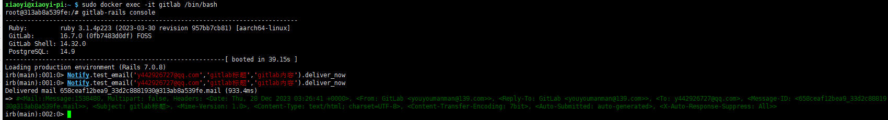
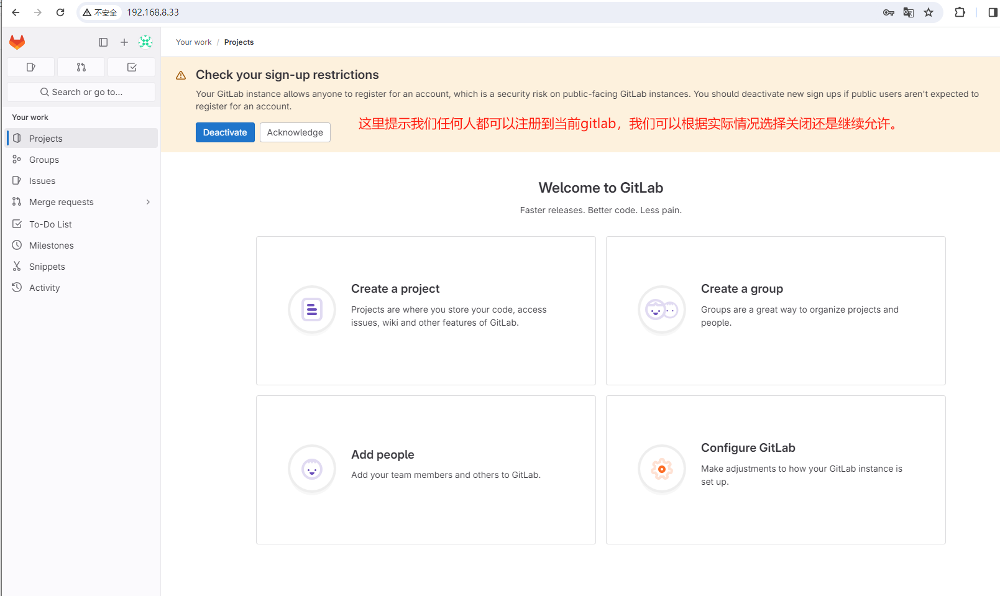

树莓派5安装docker、docker compose、gitlab-ce及配置

# 前言

大多数使用Linux的小伙伴，应该都是当成服务器使用。docker基本是跳不过的环节，也是不应该跳过的环节。这里不会讲解docker是什么，只会告诉大家怎么在pi5中安装和配置等，及其其它注意事项，帮大家顺畅安装和使用。

# 安装docker&docker compose

采用脚本安装，会使用阿里云镜像自动安装docker-ce、docker compose及其它相关软件，同时将docker设置为开机启动。

```shell
curl -fsSL get.docker.com -o get-docker.sh
sudo sh get-docker.sh --mirror Aliyun
#查看开机启动服务里是否有docker
systemctl list-unit-files | grep enabled
```


```shell
#查看docker版本
sudo docker -v
#如果开机启动里，没有docker，则可以手动设置docker开机自启
sudo systemctl enable docker
```


```shell
#V2版本使用的dockercompose 代替了v1版本的 docker-compose 命令 
sudo docker compose version
```


# 设置docker仓库镜像

```shell
sudo vim /etc/docker/daemon.json
sudo systemctl daemon-reload
sudo systemctl restart docker
sudo docker info
```

```json
{
	"registry-mirrors": [
		"http://hub-mirror.c.163.com",
		"https://docker.mirrors.ustc.edu.cn",
		"https://registry.docker-cn.com"
	]
}
```

 

# 安装gitlab

注意，gitlab在docker仓库里没有官方提交的arm64的镜像，所以我们只能找第三方提交的。

https://hub.docker.com/search?q=gitlab-ce&architecture=arm64


```shell
sudo mkdir -p /usr/local/docker/gitlab/
cd /usr/local/docker/gitlab/
sudo vim  docker-compose.yml
```


```yaml
version: '3.8' 
 
services: 
  gitlab: 
  	# docker 镜像名称
    image: 'yrzr/gitlab-ce-arm64v8:latest' 
    # 自定义容器名称
    container_name: gitlab
    # 容器的重启策略
    # no：永远不重新启动容器。
    # always：默认选项，容器停止时总是重新启动。
    # on-failure：只有在容器以非零退出代码（失败）停止时才会重新启动。
    # unless-stopped：除非容器被手动停止，否则容器将在退出时自动重启。
    restart: unless-stopped 
    ports: 
      - '80:80' 
      - '443:443' 
      - '2222:22' 
    volumes: 
       - /usr/local/docker/gitlab/config:/etc/gitlab 
       - /usr/local/docker/gitlab/data:/var/opt/gitlab 
       - /usr/local/docker/gitlab/logs:/var/log/gitlab
    environment:
        GITLAB_OMNIBUS_CONFIG: |
            gitlab_rails['smtp_enable'] = true;
            gitlab_rails['smtp_address'] ='smtp.139.com';
            gitlab_rails['smtp_port'] = 465;
            gitlab_rails['smtp_user_name'] = 'youyoumanman@139.com';
            gitlab_rails['smtp_password'] = '70925555d458ca912500';
            gitlab_rails['smtp_domain'] = '139.com';
            gitlab_rails['smtp_authentication'] = 'login';
            gitlab_rails['smtp_enable_starttls_auto'] = false;
            gitlab_rails['smtp_tls'] = true;
            gitlab_rails['gitlab_email_from'] = 'youyoumanman@139.com';
            gitlab_rails['gitlab_email_reply_to'] = 'youyoumanman@139.com';      
            external_url 'http://192.168.8.33'
          deploy:
        resources:
          limits:
            memory: 1.5G
          reservations:
            memory: 0.5G 
```

```shell
sudo docker exec -it gitlab /bin/bash
gitlab-rails console
Notify.test_email('y442926727@qq.com','gitlab标题','gitlab内容').deliver_now
```



```
#gitlab首次安装后root用户默认密码（有效期24小时）
docker exec -it 容器名字或容器ID grep 'Password:' /etc/gitlab/initial_root_password
```




### 常用命令

查看版本：sudo docker -v

查看镜像：sudo docker images

查看容器：sudo docker ps

 

启动 docker 服务：sudo systemctl start docker

停止 docker 服务：sudo systemctl stop docker 

重启 docker 服务：sudo systemctl restart docker

查看 docker 服务 状态：sudo systemctl status docker

进入一个运行中的容器：sudo docker exec -it xx /bin/bash (xx可以是Id也可以是Name)
