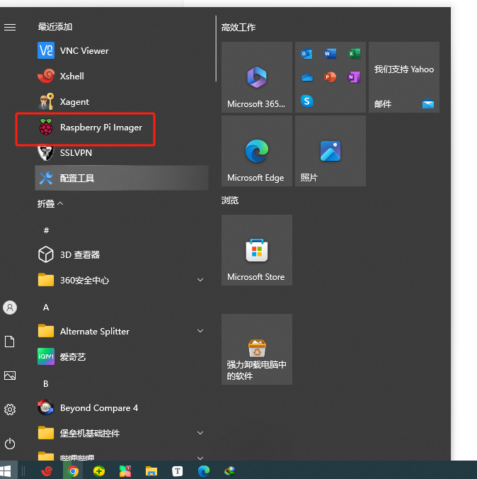

安装VIM

```
sudo apt-get install vim
sudo cp /etc/apt/sources.list /etc/apt/sources.list_`date +%Y%m%d%H%M`.bak
sudo cp /etc/apt/sources.list.d/raspi.list /etc/apt/sources.list.d/raspi.list.`date +%Y%m%d%H%M`.bak
sudo vim /etc/apt/sources.list
sudo vim /etc/apt/sources.list.d/raspi.list 

gpg --keyserver keyserver.ubuntu.com --recv-keys 9165938D90FDDD2E
gpg --export --armor 9165938D90FDDD2E | sudo apt-key add -
sudo apt-get update
sudo apt-get upgrade
```

开箱和安装&系统烧录、中文设置、拼音输入法安装和鼠标延迟问题解决等

# 前言

去年想买树莓派4的时候，突然涨价涨的厉害，不敢买，怕肉痛。所以一直心心念念到现在树莓派5出来，一套可运行8G版本套件723元（不含内存卡，具体套件见开箱图），按官方指导价80美元（折合人民币580），想想树莓派5刚刚出，感觉这个价格还是很划算。

买树莓派的目的主要是想做小服务器、或者做一些人工智能的实验，尽量希望不要被吃灰吧！

以下内容，因个人水平有限，如有错误，欢迎指正。

# 树莓派5硬件

## 开箱

这个套件里的电源5V3A，电扇也是普通不可调速风扇。


## 安装


# 树莓派系统

准备好一张TF卡，==切记要用正规的品牌==。我被坑大了一次，用了一个电商送的所谓128G大内存卡（用工具实测只有30多G），多次尝试系统烧录到最后验证总是失败，换成了正规品牌的，一次就成功了。

## 下载window版本烧录工具




## 系统烧录


### 选择需要写入的操作系统

#### 选择默认的第一个桌面版操作系统

这种方式为，通过该工具获取最新版本的桌面系统


#### 选择其它版本系统


#### 也可安装下载好的系统镜像


### 自定义写入配置

这里的主要目的是为了在烧录时，就将WiFi，SSH等信息提前写入系统。这样即时没有miniHDMI和网线，也可以使用树莓派。


### 插入TF到树莓派，开机


如果不是官方要求的电源，开机后会有提示。


## 系统中文设置及拼音输入法安装

这里提醒两点：①现在安装拼音输入法再设置系统语言，因为系统语言设置后就会要求重启系统；②按装拼音输入法前，先==不要==设置==国内软件源==，我设置了后，想安装fcitx5框架的拼音输入法，一直都安装不上。

### 安装拼音输入法

```shell
sudo apt install -y fcitx5-chinese-addons
```


### 设置系统语言为中文


### 验证拼音输入法

若重启后，右上角出现这个图标，则说明输入法安装成


我们可以打开内置Firefox火狐浏览器测试，通过Control+空格键来切换输入法。注意==内置的chromium暂时无法使用中文输入法===，我也没弄明白，以后找到问题再来更新。


## vim 编辑器安装

```
sudo apt install -y vim
```


# Q&A

## 鼠标延迟问题

某些鼠标在树莓派上使用时,会出现延迟问题。在boot目录下的cmdline文件末尾加上如下配置:usbhid.mousepoll=0具体方法是在终端输入:sudo vim /boot/cmdline.txt打开cmdline文件后,在其末尾先加上空格后,再加上:usbhid.mousepoll=0保存后重启系统,便可以解决这个问题。

```
sudo vim /boot/cmdline.txt
usbhid.mousepoll=0
```


