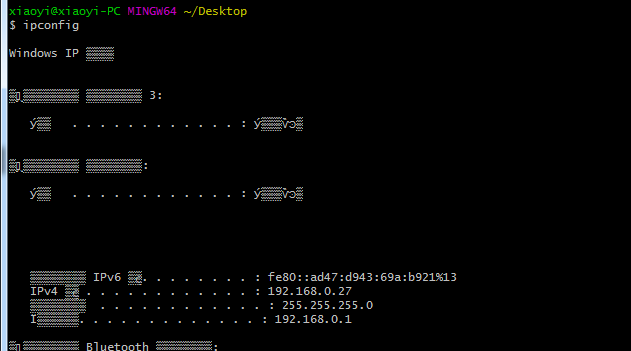
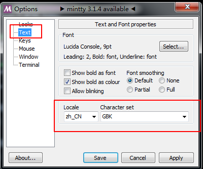
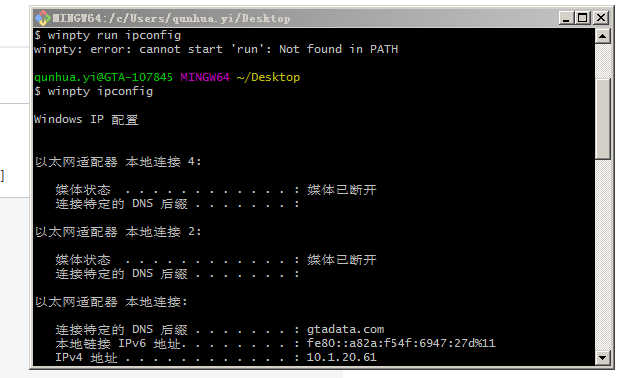

gitbash乱码







vscode终端配置

```ini
"terminal.integrated.shell.windows":  "D:\\WorkApp\\Git\\bin\\bash.exe",
"terminal.integrated.shellArgs.windows": ["--login","-i"]
```

#### 无法直接运行python

在 git bash 中运行下`python --version` 或 `pip list` 等命令，都可以正常使用。
 但是输入 `python` 却会进入前台运行界面并且无任何响应，只能 Ctrl+c 退出。
 解决方式有 3 种：

1. 使用 winpty 接口
    `winpty python`

2. 显式使用 `python -i`

3. 使用 alias 映射
    在 `/etc/bash.bashrc` 中加入 `alias python='winpty python'`，之后便可以直接输入 `python` 了

   ```bash
     #临时执行或修改/etc/profile文件，在文件内容末尾加入
     export TIME_STYLE='+%Y-%m-%d %H:%M:%S'
   ```


```powershell
#scoop
https://www.jianshu.com/p/50993df76b1c
https://blog.csdn.net/qqb67g8com/article/details/83445453
#执行策略，允许执行不信任的脚本
Set-ExecutionPolicy RemoteSigned -scope CurrentUser
iex (new-object net.webclient).downloadstring('https://raw.githubusercontent.com/lukesampson/scoop/master/bin/install.ps1')
```

