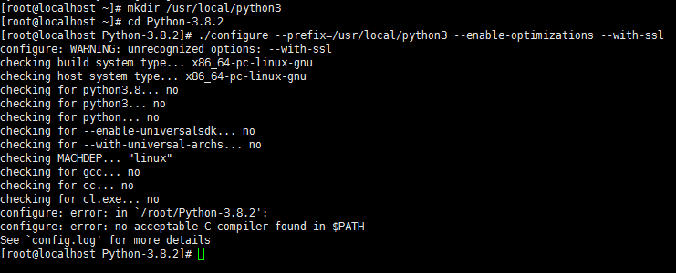
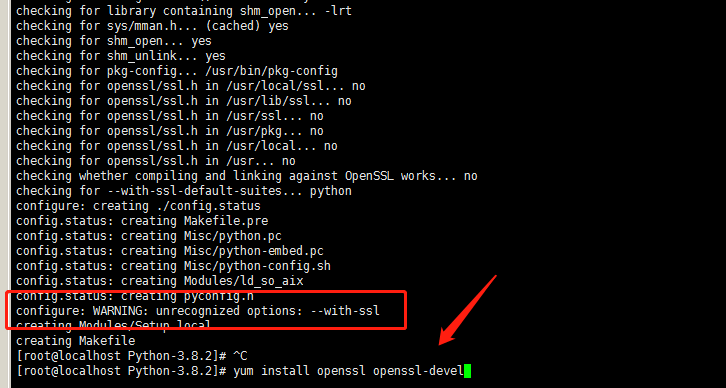
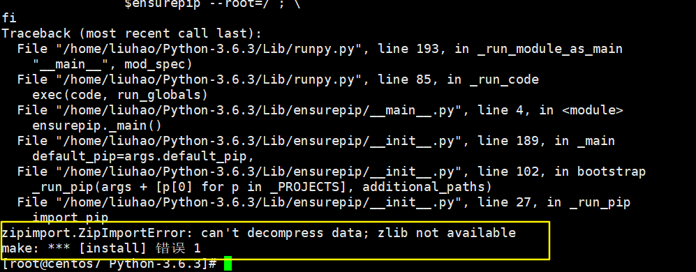
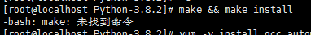
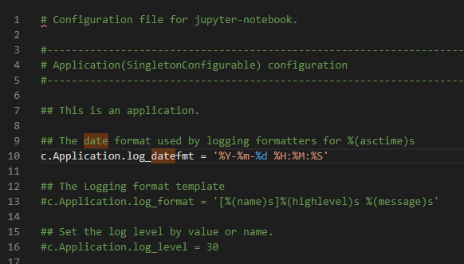
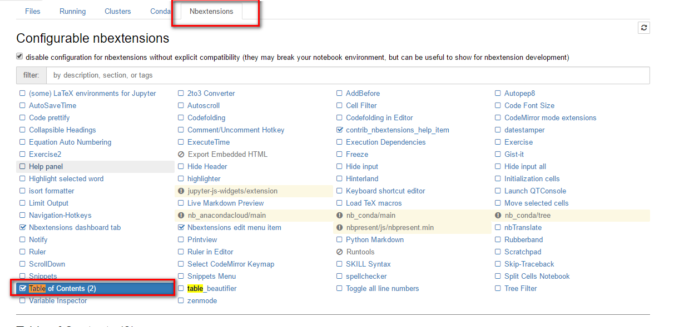
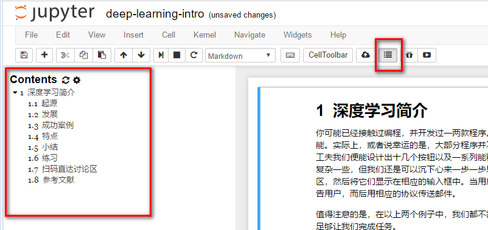

# 前言

Python是一种跨平台的 **计算机程序设计语言**。 是一个高层次的结合了解释性、编译性、互动性和面向对象的脚本语言。最初被设计用于编写自动化脚本(shell)，随着版本的不断更新和语言新功能的添加，越多被用于独立的、大型项目的开发。

很多人建议使用Anaconda包，将所有的Python环境安装好。但我不建议，因为我们初学者，要愿意折腾才知道，环境与环境的关联。如果是生产环境，我建议用Anaconda，因为我们保证生产环境的安全。

[Anaconda介绍、安装及使用教程](https://zhuanlan.zhihu.com/p/32925500)，有兴趣的可以通过这篇文章了解。

# Python

## 简介

CentOS7默认安装了Python 2.7.5，因Python 2和Python3语法差别有一定的改变，所以我们需要在系统中安装Python3。在系统中可以同时存在Python2和Python3，且为了兼容Python2的程序，我们在安装Python3的同时，保留Python2。

几乎所有的Python 2程序都需要一些修改才能正常地运行在Python 3的环境下。为了简化这个转换过程，Python 3自带了一个叫做`2to3`的实用脚本(Utility Script)，这个脚本会将你的Python 2程序源文件作为输入，然后自动将其转换到Python 3的形式。[案例研究:将`chardet`移植到Python 3(porting chardet to Python 3)](http://sebug.net/paper/books/dive-into-python3/case-study-porting-chardet-to-python-3.html#running2to3)描述了如何运行这个脚本，然后展示了一些它不能自动修复的情况。这篇附录描述了它*能够*自动修复的内容。

*[python2 与 python3 语法区别](https://www.cnblogs.com/meng-wei-zhi/articles/8194801.html)*

## 在Window环境下安装

暂略

```
python -m pip install --upgrade pip -i https://pypi.douban.com/simple
```

## 在CentOS环境下安装

### 安装

> 为什么不直接用yum安装Python，是因为pip3需要单独安装

获取Python官方下载地址 https://www.python.org/downloads/


```bash
#初始准备安装（关于此安装解疑请参考下一节“为什么要初始准备安装”）
yum -y install gcc openssl openssl-devel zlib  zlib-devel make
#下载
wget https://www.python.org/ftp/python/3.8.2/Python-3.8.2.tar.xz
#解压
tar -xvJf Python-3.8.2.tar.xz
#创建编译安装目录
mkdir /usr/local/python3
#安装
cd Python-3.8.2
./configure --prefix=/usr/local/python3 --enable-optimizations --with-ssl
#第一个指定安装的路径,不指定的话,安装过程中可能软件所需要的文件复制到其他不同目录,删除软件很不方便,复制软件也不方便.
#第二个可以提高python10%-20%代码运行速度.
#第三个是为了安装pip需要用到ssl,后面报错会有提到.
#编译和安装
make && make install
#创建软链接
ln -s /usr/local/python3/bin/python3 /usr/local/bin/python3
ln -s /usr/local/python3/bin/pip3 /usr/local/bin/pip3
#验证是否成功
python3 -V
pip3 -V
```


```bash
#安装相应的编译工具(在root用户下(不要用普通用户,麻烦),全部复制粘贴过去,一次性安装即可.)
yum -y groupinstall "Development tools"
yum -y install zlib-devel bzip2-devel openssl-devel ncurses-devel sqlite-devel readline-devel tk-devel gdbm-devel db4-devel libpcap-devel xz-devel
yum install -y libffi-devel zlib1g-dev
yum install zlib* -y
```

上面这段请勿执行，因为我们不需要所有的编译工具，按下面的命令执行就可以了。

*[安装Python3参考](https://www.cnblogs.com/xiujin/p/11477419.html)*

*[configure、make 和 make install 的区别](https://www.jianshu.com/p/c70afbbf5172)*

### 为什么要初始准备安装

#### Q:问题一(关于gcc)



A:解决方式

```bash
#安装C编译器gcc(GNU编译器套件)
yum -y install gcc
```

#### Q:问题二(关于ssl)



A:解决方式：

```bash
yum install openssl openssl-devel 
```

#### Q:问题三（关于zlib）



A:解决方式：

```
yum install zlib zlib-devel
```

#### Q:问题四（关于make）



A:解决方式：

```bash
yum install make
```

## Python库镜像加速

pip国内的一些镜像

  阿里云 http://mirrors.aliyun.com/pypi/simple/ 
  中国科技大学 https://pypi.mirrors.ustc.edu.cn/simple/ 
  豆瓣(douban) http://pypi.douban.com/simple/ 
  清华大学 https://pypi.tuna.tsinghua.edu.cn/simple/ 
  中国科学技术大学 http://pypi.mirrors.ustc.edu.cn/simple/

修改源方法：

  临时使用： 
    可以在使用pip的时候在后面加上-i参数，指定pip源 
    eg: pip install scrapy -i https://pypi.tuna.tsinghua.edu.cn/simple

  永久修改： 
    linux: 
      修改 ~/.pip/pip.conf (没有就创建一个)， 内容如下：

```
[global]
index-url = https://pypi.tuna.tsinghua.edu.cn/simple
```

**windows:** 

直接在user目录中创建一个pip目录，如：C:\Users\xx\pip，在pip 目录下新建文件pip.ini，内容如下

或者按照网友的建议：win+R 打开用户目录%HOMEPATH%，在此目录下创建 pip 文件夹，在 pip 目录下创建 pip.ini 文件, 内容如下

```
[global]
timeout = 6000
index-url = https://pypi.tuna.tsinghua.edu.cn/simple
trusted-host = pypi.tuna.tsinghua.edu.cn
```

## 常见问题

### python运行时目录

运行时目录是当前用户目录

```python
import os
path1=os.path.abspath('.')   # 表示当前所处的文件夹的绝对路径
print(path1)
path2=os.path.abspath('..')  # 表示当前所处的文件夹上一级文件夹的绝对路径
print(path2)
```

```python
import os,sys
os.chdir(os.path.dirname(sys.argv[0]))
```

### %matplotlib作用

是在使用jupyter notebook 或者 jupyter qtconsole的时候，才会经常用到%matplotlib，也就是说那一份代码可能就是别人使用jupyter notebook 或者 jupyter qtconsole进行编辑的。关于jupyter notebook是什么，可以参考这个链接：[Jupyter Notebook介绍、安装及使用教程][1]

而%matplotlib具体作用是当你调用matplotlib.pyplot的绘图函数plot()进行绘图的时候，或者生成一个figure画布的时候，可以直接在你的python console里面生成图像。

# Jupyter Notebook

## 简介

Jupyter Notebook（此前被称为 IPython notebook）是一个交互式笔记本，支持运行 40 多种编程语言。

Jupyter Notebook 的本质是一个 Web 应用程序，便于创建和共享文学化程序文档，支持实时代码，数学方程，可视化和 [markdown](https://links.jianshu.com/go?to=https%3A%2F%2Fbaike.baidu.com%2Fitem%2Fmarkdown%2F3245829)。 用途包括：数据清理和转换，数值模拟，统计建模，机器学习等等。

## 安装

[参考安装](https://www.jianshu.com/p/91365f343585)

安装Jupyter Notebook的前提是需要安装了Python（3.3版本及以上，或2.7版本）。

```bash
#升级pip
pip3 install --upgrade pip 
#安装jupyter
pip3 install jupyter
#启动
jupyter notebook
# 后台运行启动
nohup jupyter notebook --allow-root > jupyter.log 2>&1 &
```



[Jupyter Notebook介绍、安装及使用教程](https://www.jianshu.com/p/91365f343585)

[开机启动](https://blog.csdn.net/sunt2018/article/details/89641781)

配置：/root/.jupyter/jupyter_notebook_config.py

```bash
ps -ef | grep jupyter
kill -s 9 pid
```

## 插件扩展

### 扩展

```bash
#安装jupyter扩展
pip install jupyter_contrib_nbextensions
#将jupyter插件集成至jupyter中(个人之这么理解的)
jupyter contrib nbextension install --user --skip-running-check
```

### markdown目录



