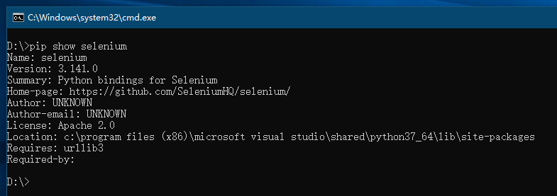
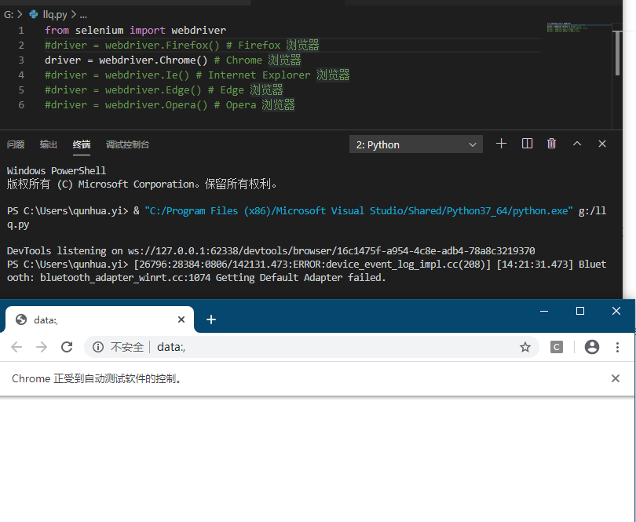

# 解决什么问题

适合自动化测试的项目
（1）任务测试明确，不会频繁变动。
（2）每日构建后的测试验证。
（3）比较频繁的回归测试。
（4）软件系统界面稳定，变动少。
（5）需要在多平台上运行的相同测试案例、组合遍历型的测试，以及大量的重复任务。
（6）软件维护周期长。
（7）项目进度压力不太大。
（8）被测软件系统开发较为规范，能够保证系统的可测试性。
（9）具备大量的自动化测试平台。
（10）测试人员具备较强的编程能力。

当然，并非以上 10 条都具备的情况下才能开展自动化测试工作。根据我们的经验，一
般来说，满足以下 3 个条件就可以对项目开展自动化测试。
（1）软件需求变动不频繁。
（2）项目周期较长。
（3）自动化测试脚本可重复使用。

# 诞生与发展历程

Selenium 经历了三个大版本，Selenium 1.0、Selenium 2.0 和 Selenium 3.0。Selenium 不
是由单独一个工具构成的，而是由一些插件和类库组成的，这些插件和类库有其各自的特
点和应用场景。

# 安装更新卸载（引用使用移除）

```bash
 # 安装最新版本
 pip install selenium  -i https://pypi.tuna.tsinghua.edu.cn/simple
 # 安装指定版本号
 pip install selenium==3.11.0 
 # 升级更新到最新版本号
 pip install -U selenium 
 # 查看当前包的版本信息
 pip show selenium 
 # 卸载 Selenium
 pip uninstall selenium 
```



## 驱动

### 驱动下载地址

各浏览器驱动下载地址如下，将浏览器驱动放在Python路径（Python.exe）旁，即可正常使用驱动。
		GeckoDriver（Firefox）：https://github.com/mozilla/geckodriver/releases 
													  https://npm.taobao.org/mirrors/geckodriver/
		ChromeDriver（Chrome）：https://sites.google.com/a/chromium.org/chromedriver/home 
															https://npm.taobao.org/mirrors/chromedriver/
		IEDriverServer（IE）：http://selenium-release.storage.googleapis.com/index.html
		OperaDriver（Opera）：https://github.com/operasoftware/operachromiumdriver/releases
		MicrosoftWebDriver（Edge）：https://developer.microsoft.com/en-us/microsoft-edge/tools/webdriver

> 注意驱动本地和本地安装浏览器版本对应

### 为什么需要驱动

因为我们自动化测试时基于浏览器的，就像软件需要数据库一样，不同的数据库连接也需要不同的驱动，所以selenium也需要不同的驱动器调用不同的浏览。

### 验证

```python
from selenium import webdriver
driver = webdriver.Firefox() # Firefox 浏览器
driver = webdriver.Chrome() # Chrome 浏览器
driver = webdriver.Ie() # Internet Explorer 浏览器
driver = webdriver.Edge() # Edge 浏览器
driver = webdriver.Opera() # Opera 浏览器
```

运行代码后，会弹出浏览器




# 注意事项

# 高级知识点