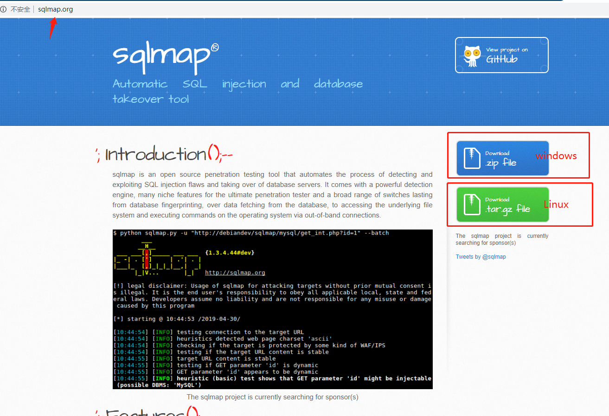
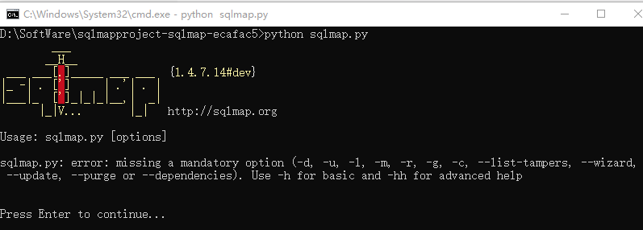
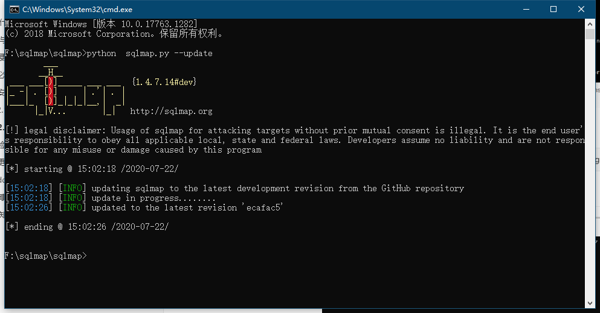
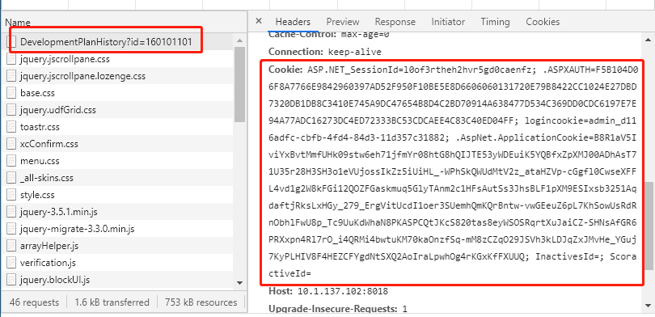
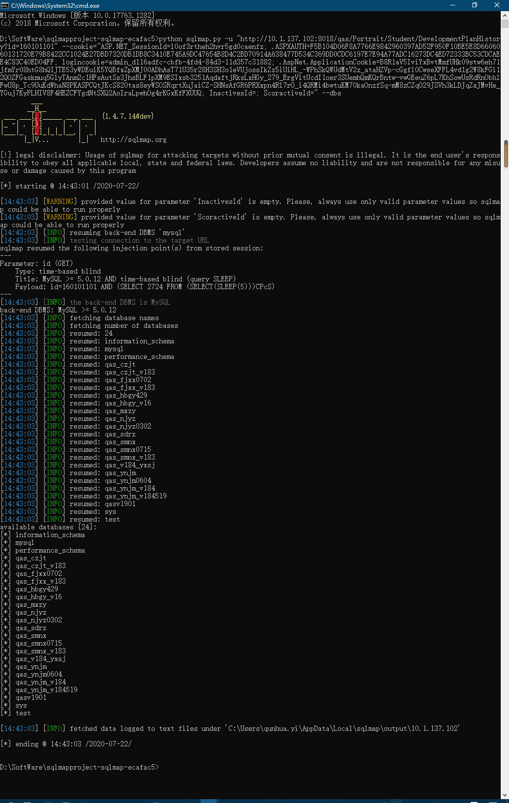

# 解决什么问题

sqlmap也是渗透中常用的一个注入工具，其实在注入工具方面，一个sqlmap就足够用了，只要你用的熟，秒杀各种工具，只是一个便捷性问题，sql注入另一方面就是手工党了，这个就另当别论了。

支持的数据库有MySQL, Oracle, PostgreSQL, Microsoft SQL Server, Microsoft Access, IBM DB2, SQLite, Firebird, Sybase和SAP MaxDB

# 诞生与发展历程

2006年7月25日，[丹尼尔·贝鲁奇](http://dbellucci.blogspot.com/)（[Daniele Bellucci）](http://dbellucci.blogspot.com/)在SourceForge上注册了sqlmap项目，并在[SourceForge子版本库中](http://sqlmap.svn.sourceforge.net/viewvc/sqlmap/)进行了开发。该框架已实现，并增加了对MySQL的有限支持。

2020年1月1日，稳定版1.4发布。

# 安装更新卸载（引用使用移除）

## 必要环境

需要Python环境支持，最新版本sqlmap已支持Python3

## 安装

### 下载方式



### git方式

```bash
git clone --depth 1 https://github.com/sqlmapproject/sqlmap.git
```

## 验证



## 更新

> 注意：更新只能支持是git方式获取的，下载的压缩包不支持

```bash
python  sqlmap.py --update
```



# 示例使用

## 前提

除门户或新闻网站，几乎所有的系统都需要登录后，才能进行业务操作。所以拿到登录后的cookie才能注入测试。



## sql注入获取到数据库列表


# 注意事项

# 高级知识点

https://blog.csdn.net/qq_36287943/article/details/104758265