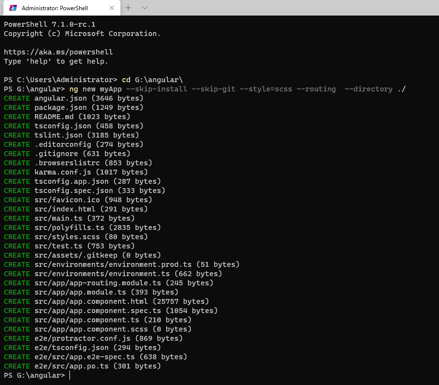
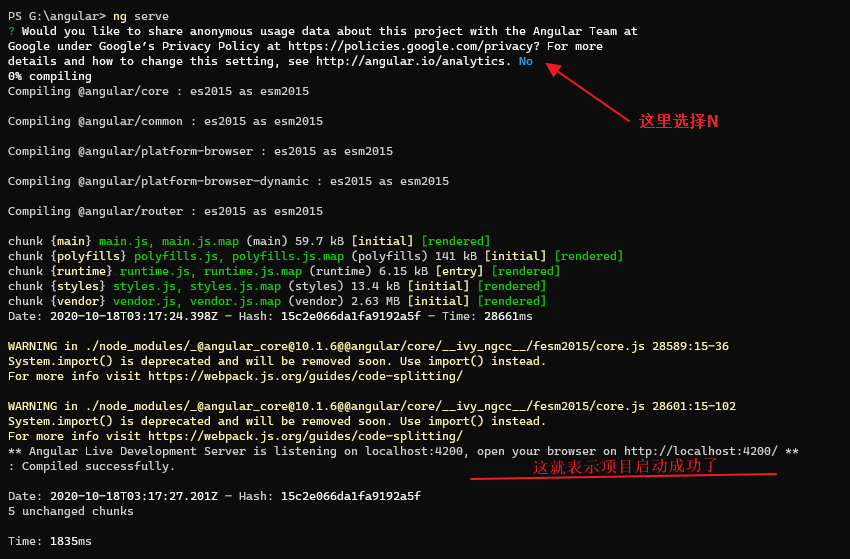

# 解决什么问题

在长期的前端开发当中，我们使用的js手动对动态数据，进行增删改查。但是如果有一个js库或者框架，能够使得当你需要对在input标签的数据进行操作时，原始json数据也跟着改变呢。你发现有什么好处没有？对，你只需要绑定数据，这样当你需要将数据提交到后台时，你再也不需要手动获取数据了，直接提交绑定的json数据对象即可。

# 诞生与发展历程

https://baijiahao.baidu.com/s?id=1664477916445181522&wfr=spider&for=pc

https://www.mopsky.com/2019/02/05/ca365f410d/

https://blog.csdn.net/xllily_11/article/details/69527396

# 安装更新卸载

```powershell
#安装或更新
cnpm install -g @angular/cli
#卸载
cnpm uninstall -g @angular/cli
```

# 项目

## 初始化项目

```powershell
#创建一个项目文件夹，在文件夹中执行(跳过安装项目插件)
#※注意，项目生成后，项目文件夹不能修改名称
ng new myApp --skip-install --skip-git --style=scss --routing  --directory ./
```



注意，如果你的项目名称是小驼峰，项目中package.js内的名称会转换成加短横线的小写名称。


## 安装项目插件

```powershell
cnpm install
```


## 启动项目

```powershell
ng serve
#或
cnpm run start
```



# 高级知识点

