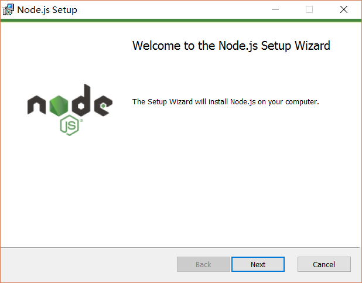
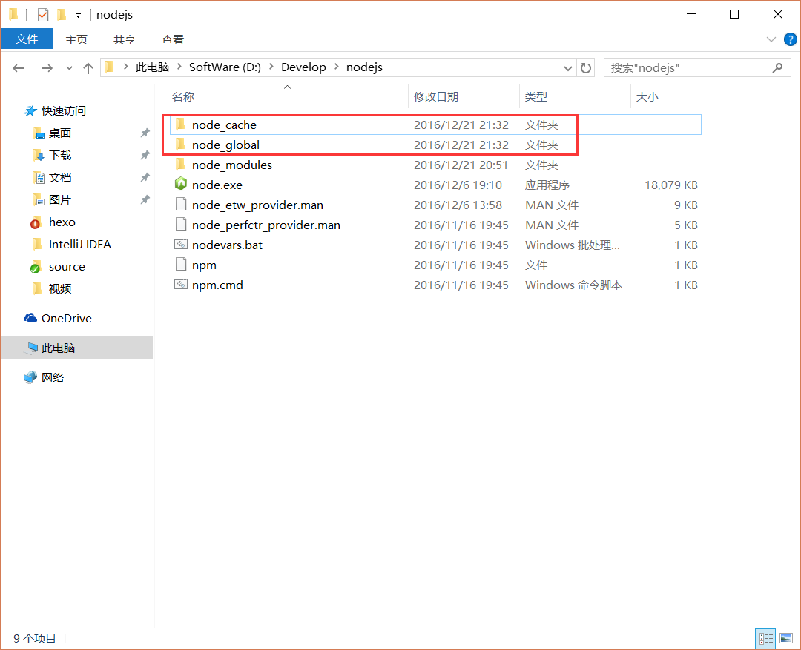

# nodejs

## 简介

1.Node.js是一个JavaScript运行时环境（可以解析和执行JavaScript代码）

2.现在的JavaScript可以完全脱离浏览器来运行，一切都归功于Node.js

3.浏览器中的JavaScript包括EcmaScript、BOM、DOM

4.Node.js中的JavaScript  ：没有BOM、DOM，用EcmaScript进行编码，主要是在Node这个JavaScript执行环境中为JavaScript提供一些服务器级别的API操作（例如文件读写、网络服务的构建、网络通信、http服务器等处理）

5.Node.js特性是 使用事件驱动、非阻塞IO模型(异步)，使得其轻量和高效

6.npm是基于Node.js开发出来的包管理工具，npm是世界上最大的开源库生态系统，绝大多数js相关的包都存放在npm上，方便开发人员下载使用

7.Google Chrome的V8引擎是目前公认的解析执行JavaScript代码最快的，Node.js构建在Google Chrome的V8引擎之上，是一个独立的JavaScript运行时环境

8.Node.js能做的事：Web服务器后台、命令行工具(npm、git、hexo)

## Windows环境中下载与安装

### 下载

在官方下载页面https://nodejs.org/en/download/，进行下载最新版本。产品开发建议使用LTS


### 安装




### 验证安装


此处说明下：Node.js已自带npm，安装Node.js时会一起安装，npm的作用就是对Node.js依赖的包进行管理，也可以理解为用来安装/卸载Node.js需要装的东西

### 镜像配置

​																																																																												

```bash
#查看已配置的地址
npm config get registry
#安装npm的淘宝镜像(http://registry.npmjs.org )
npm config set registry https://registry.npm.taobao.org
#不想用他们的，再设置回度原来的问就可答以了：
npm config set registry https://registry.npmjs.org

npm install -g cnpm --registry=https://registry.npm.taobao.org
```


### 环境配置

配置全局和缓存路径

默认全局目录是`C:\Users\Administrator\AppData\Roaming\npm\node_modules`默认`-g`也都会装到这个目录下，可以把全局变量`NODE_PATH`设置为这个目录。

通过`npm config`配置

```bash
# 设置全局模块
npm config set prefix "D:\NodeJS\node_modules\node_global"
# 设置缓存路径
npm config set cache "D:\NodeJS\node_modules\node_cache"
```


说明：这里的环境配置主要配置的是npm安装的全局模块所在的路径，以及缓存cache的路径，之所以要配置，是因为以后在执行类似：npm  install express [-g]  （后面的可选参数-g，g代表global全局安装的意思）的安装语句时，会将安装的模块安装到【C:\Users\用户名\AppData\Roaming\npm】路径中，占C盘空间。例如：我希望将全模块所在路径和缓存路径放在我node.js安装的文件夹中，则在我安装的文件夹【D:\Develop\nodejs】下创建两个文件夹【node_global】及【node_cache】如下图：



创建完两个空文件夹之后，打开cmd命令窗口，输入:

```bash
npm config set prefix "D:\Develop\nodejs\node_global"
npm config set cache "D:\Develop\nodejs\node_cache"
```

原默认为当前用户文档文件下的：


接下来设置环境变量，关闭cmd窗口，“我的电脑”-右键-“属性”-“高级系统设置”-“高级”-“环境变量”


进入环境变量对话框，在【系统变量】下新建【NODE_PATH】，输入【D:\Develop\nodejs\node_global\node_modules】，将【用户变量】下的【Path】修改为【D:\Develop\nodejs\node_global】


配置完后，安装个module测试下，我们就安装最常用的express模块，打开cmd窗口，
输入如下命令进行模块的全局安装：

```bash
npm install express -g     # -g是全局安装的意思
```


## NPM&NPX 使用介绍

### NPM&NPX 简介

NPM是随同NodeJS一起安装的包管理工具，能解决NodeJS代码部署上的很多问题，常见的使用场景有以下几种：

- 允许用户从NPM服务器下载别人编写的第三方包到本地使用。

- 允许用户从NPM服务器下载并安装别人编写的命令行程序到本地使用。

- 允许用户将自己编写的包或命令行程序上传到NPM服务器供别人使用

```
一、更新

　　1、npm-check检查更新
　　　　　　npm install -g npm-check
　　　　　　npm-check
　　2.　　npm-upgrade更新
　　　　　　npm install -g npm-upgrade
　　　　　　npm-upgrade

　　3.　　更新全局包：
　　　　　　npm update <name> -g

　　4.　　更新生产环境依赖包：
　　　　　　npm update <name> --save

　　5.　　更新开发环境依赖包：
　　　　　　npm update <name> --save-dev
　　　　　　npm install -g npm
```