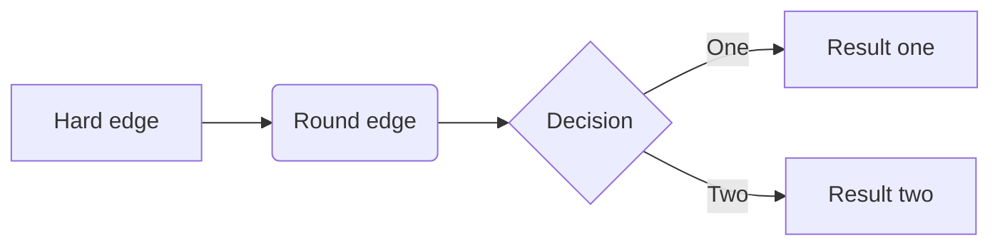
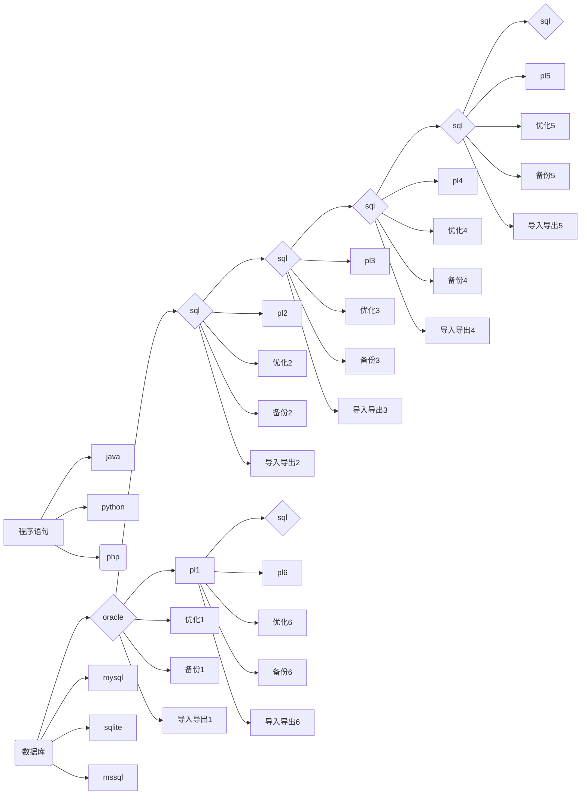

```mermaid
graph LR
A[Hard edge] -->B(Round edge)
    B --> C{Decision}
    C --> |One| D[Result one]
    C --> |Two| E[Result two]

```

```mermaid
graph LR

st[程序语句]-->java
st-->python
st-->p3(php)

s2(数据库)-->o1{oracle}
s2-->mysql
s2-->sqlite
s2-->mssql

o1-->t1{sql}
o1-->pl1
o1-->优化1
o1-->备份1
o1-->导入导出1

t1-->t2{sql}
t1-->pl2
t1-->优化2
t1-->备份2
t1-->导入导出2
t2-->t3{sql}
t2-->pl3
t2-->优化3
t2-->备份3
t2-->导入导出3
t3-->t4{sql}
t3-->pl4
t3-->优化4
t3-->备份4
t3-->导入导出4
t4-->t5{sql}
t4-->pl5
t4-->优化5
t4-->备份5
t4-->导入导出5

pl1-->t6{sql}
pl1-->pl6
pl1-->优化6
pl1-->备份6
pl1-->导入导出6
```

